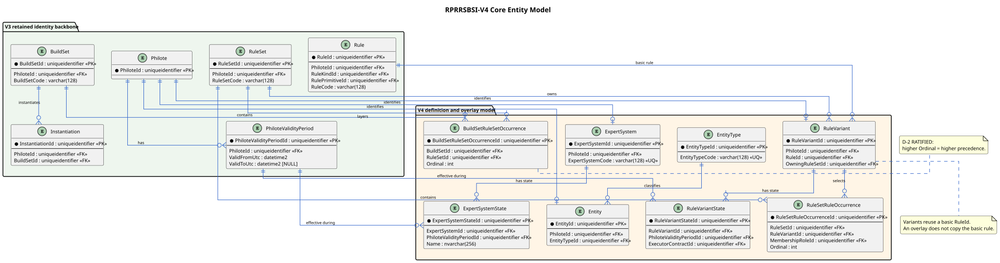
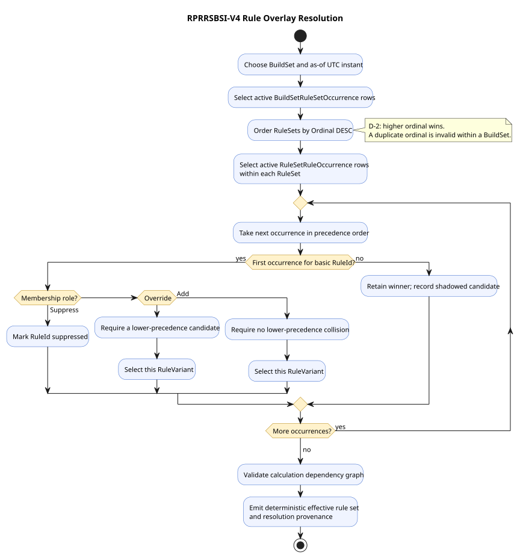
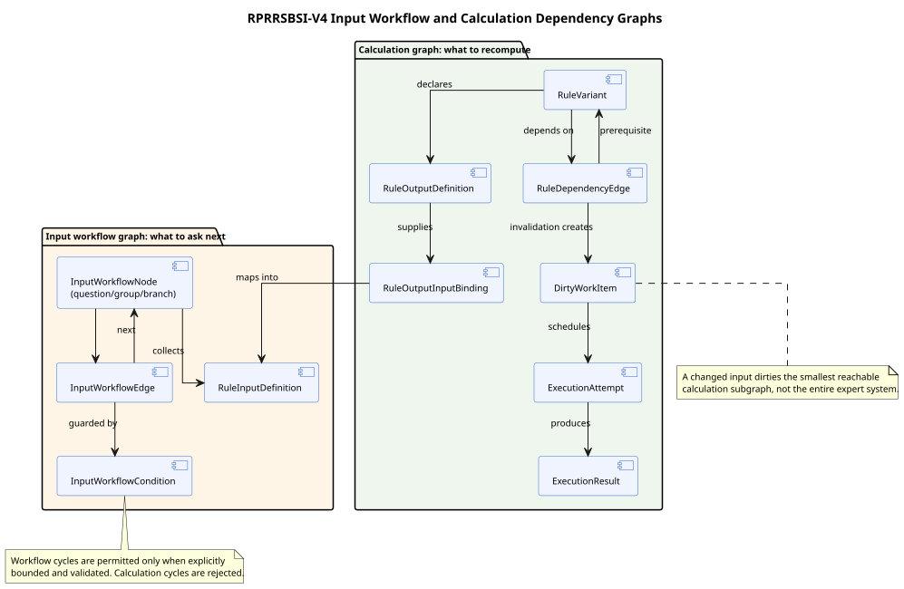

# RPRRSBSI-V4 Core Schema Enhancements

Editable diagram source: [RPRRSBSI-V4-Core-Entity-Model.puml](RPRRSBSI-V4-Core-Entity-Model.puml).

## Identity and temporal foundation

- **V4-CORE-001:** All newly introduced semantic identities SHALL initially use `uniqueidentifier` primary keys and SHALL have application-level typed-ID wrappers.
- **V4-CORE-002:** Each Philote-bearing table SHALL use the entity primary-key GUID as its `PhiloteId`, preserving the V3 shared-identity convention.
- **V4-CORE-003:** `PhiloteValidityPeriod` SHALL gain a unique constraint on `(PhiloteId, PhiloteValidityPeriodId)` so dependent state rows can prove that a validity period belongs to the expected identity.
- **V4-CORE-004:** For any Philote, validity periods SHALL be non-overlapping half-open intervals. Gaps are allowed. A null `ValidToUtc` means open ended.
- **V4-CORE-005:** Internal semantic change SHALL be represented by new GUID-identified `State` or `Variant` rows and validity periods, not by an integer or string revision number.
- **V4-CORE-006:** External product, package, firmware, and protocol versions remain domain values and are not prohibited by V4-CORE-005.
- **V4-CORE-007:** CSV and API representations of GUIDs SHALL use canonical lowercase dashed `D` format.
- **V4-CORE-008:** Database GUID equality, joins, uniqueness, and referential checks SHALL operate on native `uniqueidentifier` values. Implementations SHALL NOT obtain identity semantics by casting GUIDs to text or comparing their spelling, case, or collation.

## General entity registry

| Table        | Required columns and constraints                                                  | Purpose                                                            |
| ------------ | --------------------------------------------------------------------------------- | ------------------------------------------------------------------ |
| `EntityType` | `EntityTypeId` PK, `PhiloteId` FK, unique `EntityTypeCode`, name, description     | Stable catalog of addressable semantic kinds.                      |
| `Entity`     | `EntityId` PK, `PhiloteId` FK, `EntityTypeId` FK, optional owning-system identity | A durable endpoint for Tags, provenance, and generic associations. |

- **V4-CORE-010:** Every entity kind admitted to generic association SHALL have a fixed seeded `EntityType` identity.
- **V4-CORE-011:** Generic associations SHALL reference `Entity`, not an unconstrained GUID whose type cannot be checked.
- **V4-CORE-012:** Admission of a local table to `EntityType` SHALL be checked against the schema registry during seed validation.

## Expert-system definition

| Table                    | Key relationships                                 | Purpose                                                                                    |
| ------------------------ | ------------------------------------------------- | ------------------------------------------------------------------------------------------ |
| `ExpertSystem`           | Philote-bearing root                              | Stable identity and code for a generic or specific expert system.                          |
| `ExpertSystemState`      | `ExpertSystemId`, matching validity period        | Temporal name, description, lifecycle state, and default entry point.                      |
| `ExpertSystemComponent`  | `ExpertSystemId`, `EntityId`, role, ordinal       | Associates RuleSets, BuildSets, workflows, and other components without hiding their type. |
| `ExpertSystemEntryPoint` | `ExpertSystemId`, workflow node or BuildSet, code | Declares supported starts such as create, edit, validate, and explain.                     |

- **V4-CORE-020:** A generic expert system SHALL be definable entirely from catalog, rule, graph, and seed data; system-specific tables MAY be added only for irreducibly domain-specific facts.
- **V4-CORE-021:** Every runtime result SHALL be traceable to the expert system, BuildSet, effective rule variants, input values, and as-of instant used.
- **V4-CORE-022:** Definition data SHALL be immutable through normal application operations. Corrections create new states, variants, or overlay definitions.

## Rule variants and ordered occurrences

V3 has a basic `Rule` and set-membership joins. V4 keeps the basic identity and adds explicit variant and occurrence identities so the same rule can be supplied, overridden, suppressed, ordered, and explained without copying its definition.

| Table                       | Required columns and constraints                                                                                            |
| --------------------------- | --------------------------------------------------------------------------------------------------------------------------- |
| `RuleVariant`               | PK and Philote; `RuleId` FK; owning `RuleSetId` FK; unique variant code within owner.                                       |
| `RuleVariantState`          | PK; `RuleVariantId`; matching validity period; purpose; executor contract; normalized body/configuration; lifecycle status. |
| `RuleSetRuleOccurrence`     | PK; `RuleSetId`; `RuleVariantId`; membership role; `Ordinal`; optional condition; unique ordinal within RuleSet.            |
| `BuildSetRuleSetOccurrence` | PK; `BuildSetId`; `RuleSetId`; `Ordinal`; optional condition; unique ordinal within BuildSet.                               |
| `RuleSetMembershipRole`     | Fixed values `Add`, `Override`, `Suppress`.                                                                                 |

- **V4-CORE-030:** `RuleVariant.RuleId` SHALL identify the basic semantic rule being varied.
- **V4-CORE-031:** A baseline ATAP variant and an ACE override variant MAY reference the same `RuleId`; their `RuleVariantId` and owning RuleSet SHALL differ.
- **V4-CORE-031A:** D-4 is normative: an overlay SHALL be a `RuleVariant` of the same `RuleId`, and an occurrence with membership role `Override` SHALL select it. An implementation SHALL NOT copy the basic `Rule` to represent an overlay.
- **V4-CORE-032:** Membership and BuildSet composition SHALL use occurrence identities; the V3 composite join tables remain readable during transition but SHALL NOT constrain V4 to one occurrence per pair.
- **V4-CORE-033:** A RuleSet SHALL reject duplicate occurrence ordinals. A BuildSet SHALL reject duplicate RuleSet occurrence ordinals.
- **V4-CORE-034:** D-2 is normative: effective resolution orders BuildSet RuleSet occurrences by descending ordinal.

Editable diagram source: [RPRRSBSI-V4-Rule-Overlay-Resolution.puml](RPRRSBSI-V4-Rule-Overlay-Resolution.puml).

### Effective-resolution algorithm

1. Select the BuildSet and an explicit as-of UTC instant.
2. Select only occurrences and states active at that instant.
3. Sort RuleSets by `BuildSetRuleSetOccurrence.Ordinal DESC`.
4. Within a RuleSet, process rule occurrences in deterministic ordinal order.
5. Group candidates by basic `RuleId`; the first valid higher-precedence candidate determines the effective outcome.
6. `Suppress` emits no effective variant and records the suppressed candidates.
7. `Override` SHALL find a lower-precedence candidate for the same `RuleId`; absence is a validation error.
8. `Add` SHALL NOT collide with an already-visible lower-precedence candidate for the same `RuleId`; collision is a validation error.
9. Return selected, suppressed, and shadowed candidates with provenance. Never return an unexplained flattened set.

- **V4-CORE-035:** Resolution SHALL be deterministic for identical stored data and as-of instant.
- **V4-CORE-036:** Invalid overlay graphs SHALL be rejected before instantiation and SHALL NOT be resolved by accidental insertion order.

## Typed inputs, outputs, defaults, and constraints

| Table                        | Purpose                                                                                                                |
| ---------------------------- | ---------------------------------------------------------------------------------------------------------------------- |
| `ValueType`                  | Semantic types such as Boolean, Integer, Decimal, Text, Guid, Uri, DateTimeUtc, Duration, Quantity, and JSON document. |
| `ScalarStorageKind`          | Physical discriminant for validated scalar columns.                                                                    |
| `RuleInputDefinition`        | Stable named input, declared type, required flag, ordinal, normalization contract, and secret policy.                  |
| `RuleDefaultInputValue`      | Typed default attached to an input definition and validity period.                                                     |
| `RuleOutputDefinition`       | Stable named output, declared type, ordinal, and disposition.                                                          |
| `RuleValueConstraint`        | Range, length, pattern, allowed-set, unit, and cross-field constraint metadata.                                        |
| `InputNormalizationContract` | Named deterministic normalization behavior.                                                                            |

- **V4-CORE-040:** Typed values SHALL use a discriminated representation with at most one populated physical value column consistent with `ScalarStorageKind`.
- **V4-CORE-041:** Secret values SHALL NOT be stored as seed or runtime plaintext. The stored value is a secret name/reference only.
- **V4-CORE-042:** Defaults SHALL be distinguishable from user-supplied, imported, calculated, and inherited values.
- **V4-CORE-043:** Every normalization operation SHALL be deterministic, identified, and included in execution provenance.
- **V4-CORE-044:** D-3 is normative: a material declared-type change SHALL create a new basic semantic identity. Existing identities SHALL NOT be mutated to carry a materially different meaning.
- **V4-CORE-045:** Material changes are: (1) any change of rule kind; (2) a variable's scalar type changing to a different scalar type, including integer, character, or string variants; (3) any change between a scalar and a heap/object type; and (4) any change involving a heap/object type, including changing one heap/object value into a collection.
- **V4-CORE-046:** A default-value change and a change to text used only for visual display are non-material and MAY retain the existing semantic identity, while still using the applicable state/validity history.

### D-3 edge-case clarification register

The classifications above are ratified. The following space is intentionally retained for cases not yet classified; no implementation may infer that an unlisted case is non-material merely because it is absent.

| Edge case | Proposed classification | Rationale | Operator clarification |
| --------- | ----------------------- | --------- | ---------------------- |
| _Add case_ | _Material / non-material / context-dependent_ | _Add rationale_ | _Pending_ |

## Separate workflow and calculation graphs

Editable diagram source: [RPRRSBSI-V4-Input-And-Execution-Graphs.puml](RPRRSBSI-V4-Input-And-Execution-Graphs.puml).

| Graph                  | Tables                                                                              | Semantics                                                               |
| ---------------------- | ----------------------------------------------------------------------------------- | ----------------------------------------------------------------------- |
| Input workflow         | `InputWorkflow`, `InputWorkflowNode`, `InputWorkflowEdge`, `InputWorkflowCondition` | Controls what is asked, grouped, skipped, revisited, or explained.      |
| Calculation dependency | `RuleDependencyEdge`, `RuleOutputInputBinding`                                      | Controls dependency order, invalidation, and incremental recomputation. |

- **V4-CORE-050:** The two graphs SHALL NOT be conflated into one general edge table.
- **V4-CORE-051:** Calculation dependencies SHALL form a directed acyclic graph after effective overlay resolution.
- **V4-CORE-052:** Workflow cycles MAY exist only when explicitly bounded by a validation rule.
- **V4-CORE-053:** Bindings SHALL be type-compatible after normalization; incompatible bindings fail validation before execution.

## Runtime and incremental execution

| Table                            | Purpose                                                                        |
| -------------------------------- | ------------------------------------------------------------------------------ |
| `InstantiationState`             | Temporal lifecycle and selected effective definition for a V3 `Instantiation`. |
| `EditSession`                    | ACE-owned user editing boundary with optimistic concurrency token.             |
| `InstantiationRuleBinding`       | Frozen association between an instantiation and the effective variant used.    |
| `InputBlock` / `InputBlockState` | A grouped, repeatable, temporal set of inputs.                                 |
| `InputValue`                     | Typed value, origin, normalized form, confidence, and provenance.              |
| `InstantiationNodeState`         | Workflow progress and validation state.                                        |
| `DirtyWorkItem`                  | Minimal invalidated calculation target and cause.                              |
| `ExecutionAttempt`               | Executor, inputs hash, start/end, status, and diagnostics.                     |
| `ExecutionResult`                | Typed outputs and provenance.                                                  |

- **V4-CORE-060:** Changing an input SHALL dirty only the reachable dependent calculation subgraph.
- **V4-CORE-061:** Execution SHALL be idempotent for the same effective definition and normalized input hash unless the executor is explicitly classified otherwise.
- **V4-CORE-062:** Execution failures SHALL preserve diagnostics without replacing the last valid result.
- **V4-CORE-063:** Instantiation bindings SHALL make later explanation independent of subsequent definition changes.

## ATAP and ACE ownership boundary

- **V4-CORE-070:** ATAP SHALL own distributable reference catalogs, reference expert systems, baseline RuleSets, RuleVariants, and reference Tags.
- **V4-CORE-071:** ACE SHALL own user overlays, edit sessions, user input, user Tags, and user instantiations.
- **V4-CORE-072:** ATAP SHALL NOT require a foreign key into an ACE database.
- **V4-CORE-073:** Effective reads across ATAP and ACE SHALL use a topology-neutral union contract with explicit source authority and deterministic precedence.
- **V4-CORE-074:** Separate tables SHALL be introduced for ACE only where ownership, retention, security, or lifecycle differs materially; table-per-plugin duplication is not the default.
