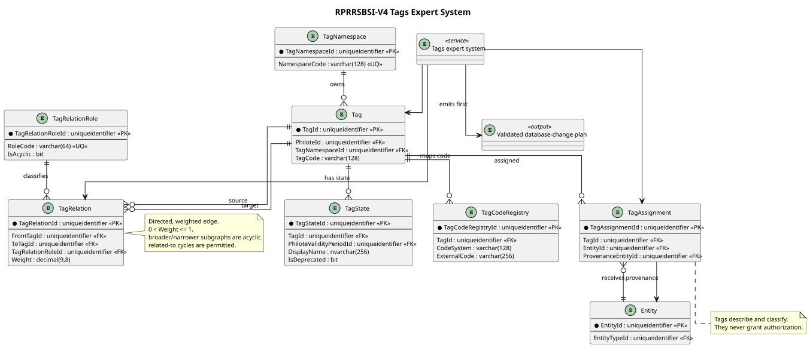

# RPRRSBSI-V4 Tags Expert System Specification

Editable diagram source: [RPRRSBSI-V4-Tags-Expert-System.puml](RPRRSBSI-V4-Tags-Expert-System.puml).

## Purpose

The Tags expert system is the first specific V4 expert system. It shall prove namespace-aware classification, temporal state, typed relations, provenance, overlay-safe user additions, validation, explanation, and plan generation without becoming an authorization system.

## Schema enhancements

| Table             | Required contract                                                                                     |
| ----------------- | ----------------------------------------------------------------------------------------------------- |
| `TagNamespace`    | Stable identity, unique namespace code, authority/owner, description.                                 |
| `Tag`             | Philote-bearing durable identity; namespace FK; tag code unique within namespace.                     |
| `TagState`        | Matching validity period; display name, description, deprecation flag, replacement Tag if any.        |
| `TagCodeRegistry` | Tag FK; external code-system identity; external code; uniqueness within code system.                  |
| `TagRelationRole` | Stable role code, inverse role if applicable, symmetry flag, acyclic flag, transitivity semantics.    |
| `TagRelation`     | Directed From/To Tag identities, role, weight, validity/provenance, no self-edge unless role permits. |
| `TagAssignment`   | Tag, generic Entity endpoint, validity, confidence/weight, origin, provenance Entity.                 |

- **V4-TAG-001:** A Tag natural key SHALL be `(TagNamespaceId, TagCode)` and SHALL be unique for the durable Tag identity.
- **V4-TAG-002:** Display name and description are temporal state; editing them SHALL NOT change Tag identity.
- **V4-TAG-003:** Deprecation SHALL preserve identity and historical as-of reads. A replacement link MAY guide new assignments.
- **V4-TAG-004:** Relationships SHALL be directed and typed. Symmetric roles SHALL be enforced as semantic symmetry, not inferred from storage order.
- **V4-TAG-005:** Every relationship weight SHALL satisfy `0 < Weight <= 1`.
- **V4-TAG-006:** `Broader`/`Narrower` hierarchical subgraphs SHALL be acyclic. `RelatedTo` cycles are permitted.
- **V4-TAG-007:** Assignments SHALL record origin and provenance sufficient to distinguish reference, imported, inferred, and user assertions.
- **V4-TAG-008:** Tags MAY classify or influence expert-system reasoning but SHALL NOT grant authentication or authorization rights.
- **V4-TAG-009:** ATAP reference Tags are immutable through ACE. ACE user Tags and assignments are ACE-owned overlays with distinct namespace authority.
- **V4-TAG-010:** Durable relationship endpoints are provisionally `TagId`; as-of meaning is supplied by active `TagState` rows, pending D-6 ratification.

## Initial reference seeds

The initial namespace SHALL include at least these coherent concepts, with stable GUIDs and descriptions:

`computing`, `hardware`, `software`, `processor`, `memory`, `storage`, `networking`, `power`, `thermal`, `form-factor`, `workload`, `local-llm`, `software-testing`, `budget-constraint`, `compatibility`, and `bill-of-materials`.

Required CSV files:

- `TagNamespace.csv`
- `Tag.csv`
- `TagState.csv`
- `TagCodeRegistry.csv`
- `TagRelationRole.csv`
- `TagRelation.csv`
- `TagAssignment.csv`

## Expert-system behavior

- **V4-TAG-020:** The system SHALL validate natural keys, external codes, active states, edge roles, weights, cycles, provenance, and endpoint types.
- **V4-TAG-021:** The system SHALL answer direct and bounded transitive traversal queries as-of a supplied UTC instant.
- **V4-TAG-022:** Each inferred result SHALL return its path, edge roles, weights, source assignments, and effective states.
- **V4-TAG-023:** Weight aggregation SHALL be an identified executor contract; the initial contract SHOULD multiply edge weights along a path and select the highest-confidence path, without silently summing independent claims.
- **V4-TAG-024:** The first manifestation output SHALL be a validated database-change plan containing proposed inserts, new states, deprecations, relations, assignments, warnings, and unresolved conflicts.
- **V4-TAG-025:** Applying that plan is a separate approved operation and is outside the first Tags implementation layer.

## Acceptance scenarios

1. Create the reference namespace and seed concepts; verify natural keys and registered GUIDs.
2. Traverse `local-llm` through its broader concepts and return a fully explained path.
3. Reject a cycle introduced into the hierarchical relation role.
4. Accept a cycle composed solely of `RelatedTo` edges.
5. Deprecate a Tag state as-of T2 while preserving its T1 name and relationships.
6. Add an ACE-owned user Tag and assignment without mutating ATAP reference rows.
7. Generate a deterministic database-change plan twice and verify identical canonical content and hash.
8. Prove a Tag assignment alone cannot satisfy an authorization check.
