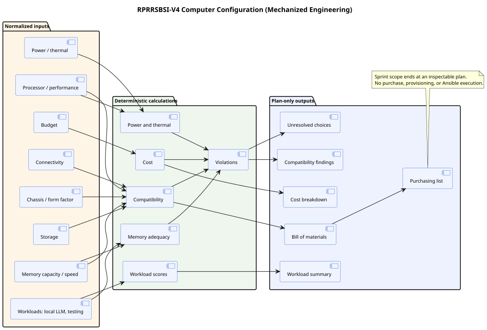

# RPRRSBSI-V4 Mechanized Engineering Specification

Editable diagram source: [RPRRSBSI-V4-Computer-Configuration.puml](RPRRSBSI-V4-Computer-Configuration.puml).

## Purpose and boundary

Mechanized Engineering is the initial computer-system configuration expert system. Its first implementation SHALL transform normalized requirements and reference component facts into an explained, validated configuration plan. It SHALL NOT purchase hardware, reserve inventory, invoke a vendor API, or execute Ansible/provisioning.

## Required inputs

| Input group       | Minimum inputs                                                                          |
| ----------------- | --------------------------------------------------------------------------------------- |
| Budget            | Maximum total cost, currency, contingency policy.                                       |
| Enclosure         | Chassis, form factor, physical limits, expansion needs.                                 |
| Compute           | Processor/platform preference, core/performance targets, accelerator needs.             |
| Memory            | Minimum/target capacity, maximum supported capacity, speed/ECC needs.                   |
| Storage           | Capacity, performance, redundancy, interface, removable/archive needs.                  |
| Connectivity      | Wired/wireless network, display, USB, peripheral, remote-management needs.              |
| Power and thermal | Available power, PSU margin, acoustic/thermal envelope, cooling constraints.            |
| Workload          | Local LLM model/quantization context, software build and testing workload, concurrency. |

- **V4-ME-001:** Every input SHALL declare type, unit where applicable, required/default status, normalization contract, constraints, and provenance.
- **V4-ME-002:** Currency and quantities SHALL be normalized before calculation while retaining the original user representation.
- **V4-ME-003:** Unknown and intentionally unconstrained SHALL be distinct values.

## Deterministic calculations

- **V4-ME-010:** Compatibility rules SHALL evaluate socket/platform, memory, form factor, interfaces, power connectors, physical clearances, and supported capacities.
- **V4-ME-011:** Cost SHALL produce line-item, subtotal, contingency, and total outputs from as-of price facts; missing prices become findings, not implicit zeroes.
- **V4-ME-012:** Power and thermal rules SHALL calculate load estimates and required margin with identified assumptions.
- **V4-ME-013:** Memory adequacy SHALL account for workload reserve and local-LLM context; the calculation SHALL expose its assumptions and inputs.
- **V4-ME-014:** Workload scoring SHALL produce separate, explainable scores rather than one opaque ranking.
- **V4-ME-015:** Violations SHALL carry severity, rule identity, implicated inputs/components, explanation, and suggested remediation.
- **V4-ME-016:** A change to budget SHALL dirty cost, budget findings, and dependent outputs but not unrelated compatibility calculations.

## Outputs

| Output                 | Required content                                                                                |
| ---------------------- | ----------------------------------------------------------------------------------------------- |
| Bill of materials      | Selected component identities, quantities, relevant as-of facts, and selection provenance.      |
| Cost breakdown         | Line items, subtotals, contingency, total, currency, missing-price findings.                    |
| Compatibility findings | Pass/warn/fail findings with rule-level explanations.                                           |
| Workload summary       | Per-workload adequacy and score, assumptions, bottlenecks.                                      |
| Purchasing list        | Plan items only: component, quantity, acceptable alternatives, unresolved vendor/price choices. |
| Unresolved choices     | Missing or conflicting requirements that block a complete plan.                                 |

- **V4-ME-020:** The plan SHALL bind to the effective BuildSet, RuleVariants, reference facts, input hash, and as-of instant.
- **V4-ME-021:** Re-running with identical inputs and reference facts SHALL produce canonically identical plan content.
- **V4-ME-022:** Recommendations SHALL include explanations sufficient for a user to identify which rule and fact caused each choice or rejection.

## Initial overlay scenario

The baseline ATAP RuleSet supplies a maximum-budget default of 1000. An ACE user overlay supplies 1500. A second active overlay at a higher BuildSet RuleSet ordinal supplies 1200. Under ratified D-2, 1200 is effective.

The scenario SHALL test:

1. as-of baseline-only resolution;
2. as-of baseline plus 1500 overlay;
3. all three active with 1200 winning by higher ordinal;
4. provenance showing both shadowed values;
5. dirty propagation limited to cost and downstream plan outputs;
6. a resulting configuration that either satisfies 1200 or produces an explained budget violation.

## Starter seed files

The first layer SHOULD use small, synthetic, license-safe data rather than scraped current products:

- `MechanizedEngineering-InputDefinitions.csv`
- `MechanizedEngineering-RuleVariants.csv`
- `MechanizedEngineering-RuleOccurrences.csv`
- `MechanizedEngineering-DependencyEdges.csv`
- `MechanizedEngineering-WorkflowNodes.csv`
- `MechanizedEngineering-WorkflowEdges.csv`
- `MechanizedEngineering-ReferenceComponents.csv`
- `MechanizedEngineering-CompatibilityFacts.csv`
- `MechanizedEngineering-ScenarioInputs.csv`
- `MechanizedEngineering-ExpectedOutputs.csv`
