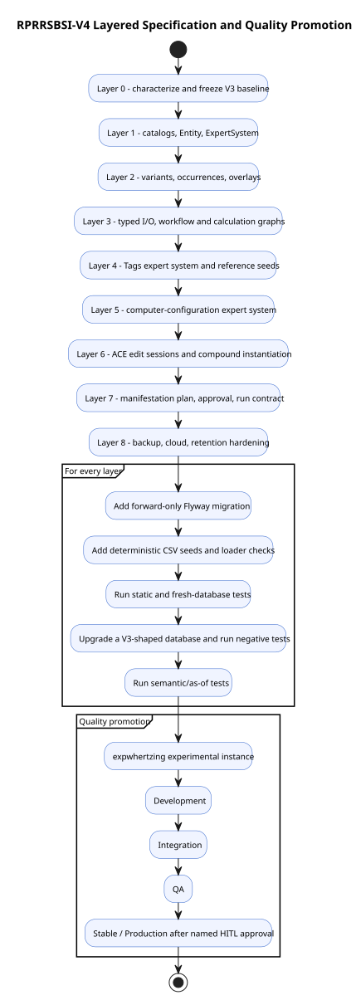

# RPRRSBSI-V4 Layered Implementation Handoff

Editable diagram source: [RPRRSBSI-V4-Layered-Delivery.puml](RPRRSBSI-V4-Layered-Delivery.puml).

This handoff is deliberately ordered from the clearest structural additions to the least-settled operational capabilities. A task-authoring agent should make each row one or more small tasks, retain the requirement IDs, and keep later layers blocked until the preceding acceptance gate passes.

## Layer 0 — V3 characterization

Deliverables: schema snapshot assertions, eleven-table contract tests, seed-count and natural-key tests, validity-period tests, and a V3-shaped upgrade fixture.

Gate: no V3 row is lost or reinterpreted; the fixture can be restored repeatedly; all current expected objects are characterized.

## Layer 1 — catalogs and generic expert-system root

Deliverables: `EntityType`, `Entity`, expert-system tables, core catalogs, fixed GUID registry entries, foundational CSVs, loader validation, and a minimal generic system.

Gate: fresh and V3-upgrade migrations pass; all catalogs load deterministically; CSV/API fixtures emit canonical lowercase dashed GUIDs; database comparisons prove equivalent GUID spellings resolve by native value; a generic definition can be queried as-of time without Tags or computer-specific code.

## Layer 2 — variants, occurrences, and overlays

Deliverables: RuleVariant tables, occurrence tables, membership-role catalog, D-2 resolver, resolution provenance, and positive/negative overlay seeds.

Gate: baseline/1500/1200 as-of scenarios pass; duplicate ordinals, invalid Add, invalid Override, and invalid Suppress data are rejected; higher ordinal wins; overlay fixtures prove the selected variant retains the same `RuleId`, is reached through an `Override` occurrence, and does not copy the rule.

## Layer 3 — typed I/O and the generic deterministic executor

Deliverables: typed input/default/output/constraint tables, workflow graph, calculation DAG, bindings, InstantiationState, dirty work, attempt/result tables, and one safe deterministic executor contract.

Gate: type errors and calculation cycles are rejected; classified material declared-type changes create new semantic identities; default-value and display-only text changes retain identity with appropriate history; input changes dirty only reachable work; identical inputs produce identical outputs and provenance. Any unclassified type-change edge case remains blocked for explicit clarification.

## Layer 4 — Tags expert system

Deliverables: Tags schema, reference CSVs, graph validation/traversal, explanations, ACE overlay boundary tests, and deterministic database-change-plan output.

Gate: all acceptance scenarios in the Tags specification pass; plan application remains disabled or separately gated.

## Layer 5 — Mechanized Engineering starter

Deliverables: normalized computer-configuration inputs, synthetic reference components/facts, compatibility/cost/power/thermal/memory/workload rules, workflow, BOM and plan outputs.

Gate: the overlay budget scenario passes; compatibility and budget violations are explained; no external effect occurs.

## Layer 6 — ACE sessions and compound instantiation

Deliverables: edit-session ownership, optimistic concurrency, repeatable input blocks, compound/nested instantiation, user Tag/overlay storage, and topology-neutral effective reads.

Gate: two-user conflict tests, reference immutability tests, and cross-store resolution tests pass under the ratified D-5 topology.

## Layer 7 — manifestation lifecycle

Deliverables: Plan, Approval, Run, Artifact, Event, and Usage concepts recovered from V2 where aligned; explicit executor classifications; approval and replay contracts.

Gate: external-effecting execution cannot occur without an approved plan, permitted tier, authorized executor, and auditable binding to immutable inputs.

## Layer 8 — operational hardening

Deliverables: backup/restore, retention, disaster recovery, cloud/topology validation, performance budgets, concurrency and security tests.

Gate: restore drills and tier-specific operational acceptance pass before Production use.

## Cross-layer task rules

- **V4-HANDOFF-001:** Every implementation task SHALL cite the V4 requirement IDs it satisfies.
- **V4-HANDOFF-002:** Every schema task SHALL include forward migration, CSV/loader impact, fresh-database test, V3-upgrade test, negative test, and documentation update.
- **V4-HANDOFF-003:** No task SHALL combine an unratified design decision with live database mutation. Ratify first, then implement.
- **V4-HANDOFF-004:** Migration application to `expwhertzing` and every promotion to a higher tier SHALL be separate from authoring and SHALL name the human-in-the-loop gate.
- **V4-HANDOFF-005:** The same immutable package SHALL be promoted upward; rebuilding between tiers is not evidence of promotion.
- **V4-HANDOFF-006:** Test breadth SHALL increase upward: static → fresh → upgrade → negative → semantic/as-of → generic → Tags → Mechanized Engineering → API/UI → backup/restore.
- **V4-HANDOFF-007:** Generated plans, evidence, and logs SHALL contain no credentials or secret values.
- **V4-HANDOFF-008:** A layer is complete only when its schema, seeds, loader behavior, tests, diagrams, and as-of/explanation behavior agree.

## Suggested task slices

For each layer, task authors should prefer slices that are independently reviewable:

1. decision/contract closure;
2. logical schema and constraints;
3. migration and rollback-by-forward-fix strategy;
4. GUID registry and CSV seeds;
5. loader validation;
6. query/resolution behavior;
7. unit and negative tests;
8. database upgrade and semantic tests;
9. documentation and evidence;
10. named experimental deployment;
11. each subsequent quality-tier promotion.

## Definition of specification-ready

The task-authoring agent may treat Layers 0–5 as specification-ready when the open decisions affecting that layer are either ratified or explicitly made a prerequisite task. Layers 6–8 are directional and require additional design closure before implementation planning.
