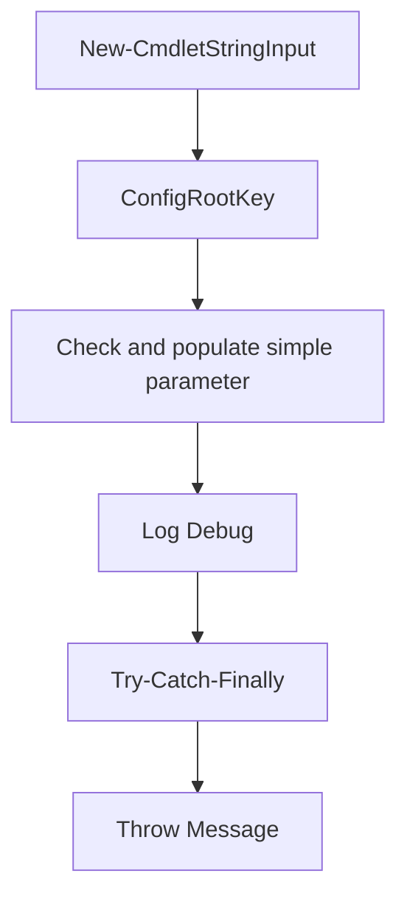
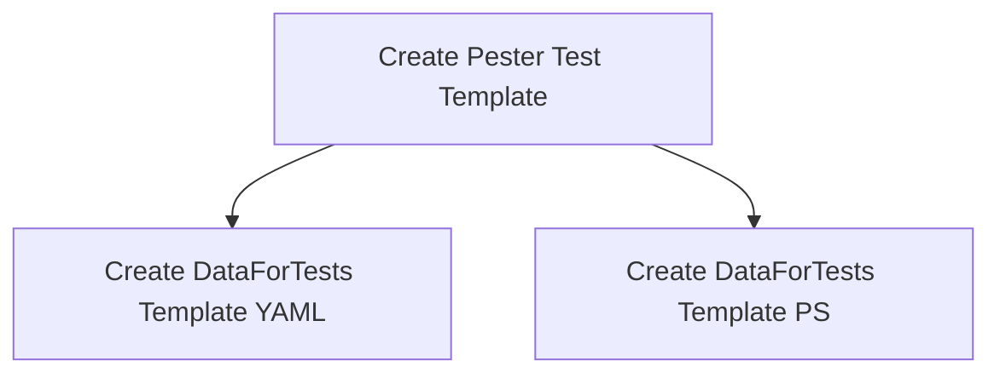
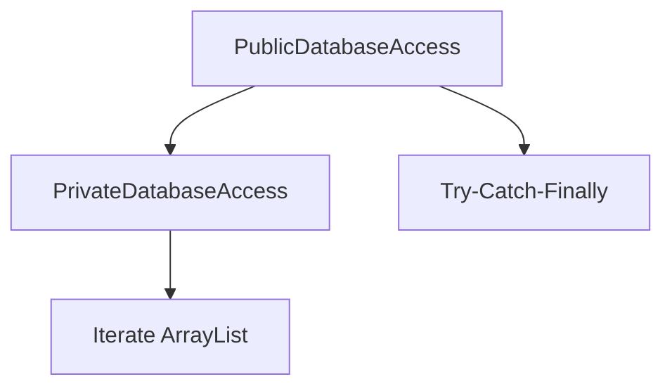

# Rules Compendium — Snippets

This file contains an overview of the Snippets-specific Rules used within the ATAP.Utilities libraries and the Ace Commander application built from these rules.

## Philote Identity Convention

Every Primitive, Rule, Rule Set, and Build Set defined in this document carries a **Philote ID**. A Philote is a .NET generic type `IPhilote<T>` where `T` is either `GUID` or `int`. All identifiers in this document use the `GUID` variant. The GUID is allocated once when the element is defined and never changes; it is the stable key back into the Ace Commander Instantiations database.

Format: `IPhilote<GUID>` — rendered in this document as a quoted GUID string, e.g. `"a3f2e1d0-1b2c-4a5b-8c9d-0e1f2a3b4c5d"`.

## Overview

This file documents VS Code Snippet Rules and Rule Sets that provide code template functionality across multiple programming languages.

Rules are created from Rule Primitives.

Rule Sets are created from Rules and include a directed graph that controls how execution flows from one Rule to another.

Snippets accelerate development by providing reusable code templates with intelligent placeholder substitution and tab stops for rapid parameter entry.

## The purpose of Rules, Rule Sets, and Build Sets

Here is a simplifying acronym to shorten the long name "Rules, Rule Sets and Build Sets". We will refer to all of those compositely as "RRSBS".

Everything in the ATAP.Utilities libraries and the Ace Commander application, and all bolt-on modules for Ace Commander, are built from RRSBS. Snippets themselves are defined using RRSBS, making them discoverable, versionable, and composable across the entire ecosystem.

## Snippet File Format

VS Code snippets are stored in JSON or JSONC (JSON with Comments) format. Each snippet file contains a single JSON object where each property defines one snippet. The property name is the snippet's display name, and the value is an object with `prefix`, `body`, and `description` properties.

## Rule Primitives

Rule Primitives are the atomic building blocks from which a Rule is constructed. Each primitive maps to a concept in the VS Code snippet grammar.

---

### `<snippet-file>` Rule Primitive

**Philote ID:** `"f8e3d2c1-4b5a-6d7e-8f9a-0b1c2d3e4f5a"`

Description: Top-level container for a VS Code snippet file. A snippet file is a JSON object containing one or more snippet definitions.

```bnf
<snippet-file>            ::= "{" <new-line>?
                                <comment-line>*
                                <snippet-definition-list>?
                              "}" <new-line>?

<snippet-definition-list> ::= <snippet-definition>
                            | <snippet-definition-list> "," <new-line> <snippet-definition>
```

Body: Complete JSON object containing all snippet definitions.

Inputs:

- `Comments` (array of comment strings, optional) — file-level comments explaining the file's purpose.
- `Snippets` (ordered list of `<snippet-definition>` instances) — the snippet definitions in the file.

Output: Rendered `.jsonc` or `.json` file text.

Attribution:

```text
1. https://code.visualstudio.com/docs/editor/userdefinedsnippets
2. https://code.visualstudio.com/api/language-extensions/snippet-guide
```

---

### `<snippet-definition>` Rule Primitive

**Philote ID:** `"a1b2c3d4-5e6f-7a8b-9c0d-1e2f3a4b5c6d"`

Description: A complete snippet definition with a unique name, trigger prefix, body content, and description.

```bnf
<snippet-definition>  ::= <quoted-string> ":" <ws>? "{" <new-line>?
                           <snippet-properties>
                         "}"

<snippet-properties>  ::= <prefix-property> "," <new-line>?
                           <body-property>
                           ("," <new-line>? <description-property>)?
                           ("," <new-line>? <scope-property>)?
```

Inputs:

- `Name` (string) — display name shown in IntelliSense.
- `Prefix` (string or string array) — trigger text typed by user.
- `Body` (string or string array) — template content with placeholders.
- `Description` (string, optional) — explanatory text shown in IntelliSense.
- `Scope` (string, optional) — comma-separated language identifiers limiting where snippet applies.

Output: Single snippet definition in JSON format.

Attribution:

```text
1. https://code.visualstudio.com/docs/editor/userdefinedsnippets#_snippet-syntax
```

---

### `<prefix-property>` Rule Primitive

**Philote ID:** `"b2c3d4e5-6f7a-8b9c-0d1e-2f3a4b5c6d7e"`

Description: The trigger prefix that activates the snippet.

```bnf
<prefix-property>     ::= <quoted-string> "prefix" <quoted-string> ":"  <ws>?
                           (<quoted-string> | <string-array>)

<string-array>        ::= "[" <string-list>? "]"

<string-list>         ::= <quoted-string>
                        | <string-list> "," <ws>? <quoted-string>
```

Inputs:

- `Prefix` (string or string array) — one or more trigger sequences.

Output: JSON property `"prefix": "value"` or `"prefix": ["value1", "value2"]`.

Attribution:

```text
1. https://code.visualstudio.com/docs/editor/userdefinedsnippets#_snippet-syntax
```

---

### `<body-property>` Rule Primitive

**Philote ID:** `"c3d4e5f6-7a8b-9c0d-1e2f-3a4b5c6d7e8f"`

Description: The template body containing the code to insert, with optional placeholders and tab stops.

```bnf
<body-property>       ::= <quoted-string> "body" <quoted-string> ":" <ws>?
                           (<quoted-string> | <string-array>)
```

Body Content Grammar:

```bnf
<body-content>        ::= <text-with-placeholders>

<text-with-placeholders> ::= (<literal-text> | <placeholder> | <choice> | <variable>)*

<placeholder>         ::= "$" <digit>                      ; simple tab stop
                        | "${" <digit> "}"                 ; tab stop with braces
                        | "${" <digit> ":" <default-text> "}" ; tab stop with default text

<choice>              ::= "${" <digit> "|" <choice-list> "|}" ; predefined choices

<choice-list>         ::= <choice-option>
                        | <choice-list> "," <choice-option>

<variable>            ::= "$" <variable-name>              ; simple variable
                        | "${" <variable-name> "}"         ; variable with braces
                        | "${" <variable-name> ":" <default-text> "}"  ; variable with default

<variable-name>       ::= "TM_SELECTED_TEXT" | "TM_CURRENT_LINE" | "TM_CURRENT_WORD"
                        | "TM_LINE_INDEX" | "TM_LINE_NUMBER" | "TM_FILENAME"
                        | "TM_FILENAME_BASE" | "TM_DIRECTORY" | "TM_FILEPATH"
                        | "CLIPBOARD" | "WORKSPACE_NAME" | "WORKSPACE_FOLDER"
                        | "CURRENT_YEAR" | "CURRENT_MONTH" | "CURRENT_DATE"
                        | "CURRENT_HOUR" | "CURRENT_MINUTE" | "CURRENT_SECOND"
                        | "BLOCK_COMMENT_START" | "BLOCK_COMMENT_END"
                        | "LINE_COMMENT"

<digit>               ::= "0" | "1" | "2" | "3" | "4" | "5" | "6" | "7" | "8" | "9"
```

Special Sequences:

- `$0` — final cursor position after all tab stops.
- `$1`, `$2`, etc. — tab stop positions navigated with Tab key.
- `${1:default}` — tab stop with default text that gets selected.
- `${1|option1,option2|}` — dropdown choice list.
- `\\$` — literal dollar sign (escaped).
- `\\\\` — literal backslash (escaped).
- `\\n` — newline character.
- `\\t` — tab character.

Inputs:

- `Lines` (string array) — each line of the template body.
- `Placeholders` (array of placeholder definitions with position and default text).
- `Variables` (array of variable references).

Output: JSON property `"body": ["line1", "line2", ...]` or `"body": "singleLine"`.

Attribution:

```text
1. https://code.visualstudio.com/docs/editor/userdefinedsnippets#_snippet-syntax
2. https://code.visualstudio.com/docs/editor/userdefinedsnippets#_variables
```

---

### `<description-property>` Rule Primitive

**Philote ID:** `"d4e5f6a7-8b9c-0d1e-2f3a-4b5c6d7e8f9a"`

Description: Human-readable description of the snippet's purpose.

```bnf
<description-property> ::= <quoted-string> "description" <quoted-string> ":" <ws>? <quoted-string>
```

Inputs:

- `Description` (string) — explanatory text.

Output: JSON property `"description": "text"`.

Attribution:

```text
1. https://code.visualstudio.com/docs/editor/userdefinedsnippets
```

---

### `<scope-property>` Rule Primitive

**Philote ID:** `"e5f6a7b8-9c0d-1e2f-3a4b-5c6d7e8f9a0b"`

Description: Language scope restricting where the snippet is available.

```bnf
<scope-property>      ::= <quoted-string> "scope" <quoted-string> ":" <ws>? <quoted-string>
```

Inputs:

- `Scope` (string) — comma-separated language IDs (e.g., `"javascript,typescript"`).

Output: JSON property `"scope": "javascript,typescript"`.

Attribution:

```text
1. https://code.visualstudio.com/docs/editor/userdefinedsnippets#_snippet-scope
```

---

## Rules

Rules are complete, instantiable snippets composed from primitives. Each Rule represents an actual code template defined in the repository's snippet files.

---

### YAML Snippets

---

#### `Create DataForTests Template (YAML)` Rule

**Philote ID:** `"f9a8b7c6-5d4e-3f2a-1b0c-9d8e7f6a5b4c"`

**Description:** Template for a Pester DataForTests.yaml file containing test case definitions.

**Language:** YAML (Pester test data)

**Composition:**

| Sequence | Primitive                | Value                                          |
| -------- | ------------------------ | ---------------------------------------------- |
| 1        | `<snippet-definition>`   | Name: "Create DataForTests Template (YAML)"    |
| 2        | `<prefix-property>`      | "PTestDataYAML"                                |
| 3        | `<body-property>`        | (17-line array, see below)                     |
| 4        | `<description-property>` | "Template for a Pester DataForTests.yaml file" |

**Body Content:**

```yaml
# File: ${1:Function}.DataForTests.yaml
# This file must contain an array of test case objects

- Name: happy path
  Params:
    X: 2
    Y: 3
  Expected: 5
  Tags: [Unit]

- Name: edge – negatives
  Params:
    X: -1
    Y: -4
  Expected: -5
  Tags: [Unit, Edge]
```

**Placeholders:**

- `$1` (default: `Function`) — function name to be tested.

**Purpose:** Quickly scaffold YAML-based test data for Pester's `ForEach` / `-TestCases` pattern.

**Attribution:**

```text
1. https://pester.dev/docs/usage/data-driven-tests
2. C:\Dropbox\whertzing\GitHub\SharedVSCode\UserSnippetsYAML.jsonc
```

---

### PowerShell Snippets

---

#### `Check and populate simple parameter` Rule

**Philote ID:** `"a2b3c4d5-6e7f-8a9b-0c1d-2e3f4a5b6c7d"`

**Description:** Check and populate the value of a cmdlet parameter using `Get-PVal` from `$global:settings`.

**Language:** PowerShell

**Composition:**

| Sequence | Primitive                | Value                                                                                             |
| -------- | ------------------------ | ------------------------------------------------------------------------------------------------- |
| 1        | `<snippet-definition>`   | Name: "Check and populate simple parameter"                                                       |
| 2        | `<prefix-property>`      | "CheckAndPopulateSimpleParameter"                                                                 |
| 3        | `<body-property>`        | (1-line expression)                                                                               |
| 4        | `<description-property>` | "Check and populate the value of a cmdlet parameter that uses a global:settings by the same name" |

**Body Content:**

```powershell
		${1:ParameterName} = Get-PVal -ParameterName {1:ParameterName} -originalPSBoundParameters $PSBoundParameters -dottedPath {1:ParameterName} -DefaultValue ${1:ParameterName}
```

**Placeholders:**

- `$1` — parameter name (used 5 times for consistency).

**Purpose:** Standardized parameter resolution pattern following `Powershell.instructions.md` guidelines.

**Attribution:**

```text
1. SolutionDocumentation/Rules Compendium.Powershell.md (Get-PVal pattern)
2. C:\Dropbox\whertzing\GitHub\SharedVSCode\UserSnippetsPowershell.jsonc
```

---

#### `Check and populate simple parameter as Type` Rule

**Philote ID:** `"b3c4d5e6-7f8a-9b0c-1d2e-3f4a5b6c7d8e"`

**Description:** Check and populate a parameter with explicit type casting via `Get-PVal -AsType`.

**Language:** PowerShell

**Composition:**

| Sequence | Primitive                | Value                                                                                             |
| -------- | ------------------------ | ------------------------------------------------------------------------------------------------- |
| 1        | `<snippet-definition>`   | Name: "Check and populate simple parameter as Type"                                               |
| 2        | `<prefix-property>`      | "CheckAndPopulateSimpleParameterAsType"                                                           |
| 3        | `<body-property>`        | (1-line expression with `-AsType`)                                                                |
| 4        | `<description-property>` | "Check and populate the value of a cmdlet parameter that uses a global:settings by the same name" |

**Body Content:**

```powershell
		${1:ParameterName} =  Get-PVal -ParameterName {1:ParameterName} -originalPSBoundParameters $PSBoundParameters -dottedPath {1:ParameterName} -DefaultValue ${1:ParameterName} -AsType ${2:ParameterType}
```

**Placeholders:**

- `$1` — parameter name.
- `$2` — parameter type (e.g., `int`, `string[]`, `DateTime`).

**Purpose:** Ensures type-safe parameter resolution when `$global:settings` returns strings that need conversion.

**Attribution:**

```text
1. C:\Dropbox\whertzing\GitHub\SharedVSCode\UserSnippetsPowershell.jsonc
```

---

#### `Check and populate Deep parameter` Rule

**Philote ID:** `"c4d5e6f7-8a9b-0c1d-2e3f-4a5b6c7d8e9f"`

**Description:** Check and populate a parameter from an arbitrary settings hash table.

**Language:** PowerShell

**Composition:**

| Sequence | Primitive                | Value                                                                                                       |
| -------- | ------------------------ | ----------------------------------------------------------------------------------------------------------- |
| 1        | `<snippet-definition>`   | Name: "Check and populate Deep parameter"                                                                   |
| 2        | `<prefix-property>`      | "CheckAndPopulateDeepParameter"                                                                             |
| 3        | `<body-property>`        | (1-line expression with `-Settings`)                                                                        |
| 4        | `<description-property>` | "Check and populate the value of a cmdlet parameter that uses an arbitrary settings hash and a dotted name" |

**Body Content:**

```powershell
		${1:ParameterName} = Get-PVal -ParameterName {1:ParameterName} -originalPSBoundParameters $PSBoundParameters -dottedPath {1:ParameterName} -DefaultValue ${1:ParameterName} -Settings ${2:Settings}
```

**Placeholders:**

- `$1` — parameter name.
- `$2` — settings variable name (e.g., `$databasesCollection`).

**Purpose:** Allows parameter resolution from nested configuration structures beyond `$global:settings`.

**Attribution:**

```text
1. C:\Dropbox\whertzing\GitHub\SharedVSCode\UserSnippetsPowershell.jsonc
```

---

#### `Check and populate Deep parameter as Type` Rule

**Philote ID:** `"d5e6f7a8-9b0c-1d2e-3f4a-5b6c7d8e9f0a"`

**Description:** Check and populate a parameter from an arbitrary settings hash with type casting.

**Language:** PowerShell

**Composition:**

| Sequence | Primitive                | Value                                                                                                       |
| -------- | ------------------------ | ----------------------------------------------------------------------------------------------------------- |
| 1        | `<snippet-definition>`   | Name: "Check and populate Deep parameter as Type"                                                           |
| 2        | `<prefix-property>`      | "CheckAndPopulateDeepParameterAsType"                                                                       |
| 3        | `<body-property>`        | (1-line expression with `-Settings` and `-AsType`)                                                          |
| 4        | `<description-property>` | "Check and populate the value of a cmdlet parameter that uses an arbitrary settings hash and a dotted name" |

**Body Content:**

```powershell
		${1:ParameterName} = Get-PVal -ParameterName {1:ParameterName} -originalPSBoundParameters $PSBoundParameters -dottedPath {1:ParameterName} -DefaultValue ${1:ParameterName} -Settings ${2:Settings} -AsType ${3:ParameterType}
```

**Placeholders:**

- `$1` — parameter name.
- `$2` — settings variable name.
- `$3` — parameter type.

**Purpose:** Combines custom settings navigation with type-safe conversion.

**Attribution:**

```text
1. C:\Dropbox\whertzing\GitHub\SharedVSCode\UserSnippetsPowershell.jsonc
```

---

#### `New-Cmdlet with String as primary input` Rule

**Philote ID:** `"e6f7a8b9-0c1d-2e3f-4a5b-6c7d8e9f0a1b"`

**Description:** Complete cmdlet template with string pipeline input, aligned with `Powershell.instructions.md` logging and error handling rules.

**Language:** PowerShell

**Composition:**

| Sequence | Primitive                | Value                                                                      |
| -------- | ------------------------ | -------------------------------------------------------------------------- |
| 1        | `<snippet-definition>`   | Name: "New-Cmdlet with String as primary input"                            |
| 2        | `<prefix-property>`      | "New-CmdletStringInput"                                                    |
| 3        | `<body-property>`        | (100+ line template)                                                       |
| 4        | `<description-property>` | "Cmdlet template (string pipeline input) aligned with logging/error rules" |

**Body Structure:**

- Comment-based help (`<#...#>`)
- `[CmdletBinding]` with `SupportsShouldProcess`
- Pipeline-enabled parameter accepting`[string[]]`
- `BEGIN` block: Load dependencies, validate parameters
- `PROCESS` block: Iterate pipeline input with `ShouldProcess` guard
- `END` block: Cleanup logging

**Placeholders:**

- `$1` — Verb-Noun cmdlet name (appears 6 times).
- `$2` — Primary string parameter name (appears 7 times).

**Key Features:**

- PSFramework logging (`Write-PSFMessage`)
- Dependency loading with error handling
- `Get-ParameterValueFromNeoConfigurationRoot` integration
- Private function loading pattern
- BitWarden credential retrieval capability

**Purpose:** Scaffolds production-ready PowerShell cmdlet following repository conventions.

**Attribution:**

```text
1. .github/instructions/Powershell.instructions.md
2. C:\Dropbox\whertzing\GitHub\SharedVSCodeUserSnippetsPowershell.jsonc
```

---

#### `Create Pester Test Template` Rule

**Philote ID:** `"f7a8b9c0-1d2e-3f4a-5b6c-7d8e9f0a1b2c"`

**Description:** Comprehensive Pester 5+ test script with optional external data file loading (PS1, YAML, JSON).

**Language:** PowerShell (Pester)

**Composition:**

| Sequence | Primitive                | Value                                                               |
| -------- | ------------------------ | ------------------------------------------------------------------- |
| 1        | `<snippet-definition>`   | Name: "Create Pester Test Template"                                 |
| 2        | `<prefix-property>`      | "PesterTest"                                                        |
| 3        | `<body-property>`        | (60+ line template)                                                 |
| 4        | `<description-property>` | "Template for a Pester test script with optional data file loading" |

**Body Structure:**

```powershell
# Section 0: Locate & load optional test data files
# Section 1: Static tests (no data required)
# Section 2: Data-driven tests (ForEach pattern)
```

**Data File Discovery:**

- Searches for `<Stem>.DataForTests.{ps1,yml,yaml,json}`
- Uses `ConvertFrom-Yaml` or `ConvertFrom-Json` for structured formats
- Dot-sources PowerShell data files

**Placeholders:**

- `$1` — Function name being tested (appears 5 times).

**Purpose:** Unified test structure supporting both static and parameterized test cases.

**Attribution:**

```text
1. https://pester.dev/docs/usage/data-driven-tests
2. .github/instructions/pesterTest.instructions.md
3. C:\Dropbox\whertzing\GitHub\SharedVSCode\UserSnippetsPowershell.jsonc
```

---

#### `Create DataForTests Template (PS)` Rule

**Philote ID:** `"a8b9c0d1-2e3f-4a5b-6c7d-8e9f0a1b2c3d"`

**Description:** PowerShell array-based test data structure for Pester's `-TestCases` / `-ForEach`.

**Language:** PowerShell

**Composition:**

| Sequence | Primitive                | Value                                         |
| -------- | ------------------------ | --------------------------------------------- |
| 1        | `<snippet-definition>`   | Name: "Create DataForTests Template (PS)"     |
| 2        | `<prefix-property>`      | "pesterDataForTestPS"                         |
| 3        | `<body-property>`        | (7-line hashtable array)                      |
| 4        | `<description-property>` | "Template for a Pester DataForTests.ps1 file" |

**Body Content:**

```powershell
@(
	@{
		Name      = 'happy path'
		Params   = @{ X = 2; Y = 3 }
		Expected = 5
		Tags     = 'Unit'
	}
)
```

**Purpose:** Quick inline test data definition when external YAML/JSON files are not needed.

**Attribution:**

```text
1. https://pester.dev/docs/usage/data-driven-tests
2. C:\Dropbox\whertzing\GitHub\SharedVSCode\UserSnippetsPowershell.jsonc
```

---

#### `ConfigRootKey` Rule

**Philote ID:** `"b9c0d1e2-3f4a-5b6c-7d8e-9f0a1b2c3d4e"`

**Description:** Boilerplate for accessing configuration keys from `$global:ConfigRootKeys`.

**Language:** PowerShell

**Composition:**

| Sequence | Primitive                | Value                                            |
| -------- | ------------------------ | ------------------------------------------------ |
| 1        | `<snippet-definition>`   | Name: "ConfigRootKey"                            |
| 2        | `<prefix-property>`      | "ConfigRootKey"                                  |
| 3        | `<body-property>`        | `$$global:ConfigRootKeys['{1:rootkey}']`         |
| 4        | `<description-property>` | "boilerplate around using a configrootkey entry" |

**Placeholders:**

- `$1` — root key name (e.g., `DatabasesCollectionConfigRootKey`).

**Purpose:** Standardize access to configuration root keys across cmdlets.

**Attribution:**

```text
1. .github/copilot-instructions.md (Configuration Model section)
2. C:\Dropbox\whertzing\GitHub\SharedVSCode\UserSnippetsPowershell.jsonc
```

---

#### `Log Debug` Rule

**Philote ID:** `"c0d1e2f3-4a5b-6c7d-8e9f-0a1b2c3d4e5f"`

**Description:** PSFramework debug-level logging statement.

**Language:** PowerShell

**Composition:**

| Sequence | Primitive                | Value                                                 |
| -------- | ------------------------ | ----------------------------------------------------- |
| 1        | `<snippet-definition>`   | Name: "Log Debug"                                     |
| 2        | `<prefix-property>`      | "LogDebug"                                            |
| 3        | `<body-property>`        | `Write-PSFMessage` call                               |
| 4        | `<description-property>` | "Log message using Write-PSFMessage with level Debug" |

**Body Content:**

```powershell
	Write-PSFMessage -FunctionName $fn -ModuleName '<moduleName>' -Level Debug -Message ("${1:VariableToLog} is $${1:VariableToLog}")
```

**Placeholders:**

- `$1` — variable name to log (appears twice).

**Purpose:** Consistent debug logging following PSFramework conventions.

**Attribution:**

```text
1. https://psframework.org/documentation/documents/psframework/logging.html
2. C:\Dropbox\whertzing\GitHub\SharedVSCode\UserSnippetsPowershell.jsonc
```

---

#### `Throw Message` Rule

**Philote ID:** `"d1e2f3a4-5b6c-7d8e-9f0a-1b2c3d4e5f6a"`

**Description:** Code block to log error message, optional stack trace, then rethrow exception preserving call stack.

**Language:** PowerShell

**Composition:**

| Sequence | Primitive                | Value                                                                                                                            |
| -------- | ------------------------ | -------------------------------------------------------------------------------------------------------------------------------- |
| 1        | `<snippet-definition>`   | Name: "Throw Message"                                                                                                            |
| 2        | `<prefix-property>`      | "ThrowMessage"                                                                                                                   |
| 3        | `<body-property>`        | (6-line error handling block)                                                                                                    |
| 4        | `<description-property>` | "code block to log errorMessage and optional stack trace, Write-PSFMessage it and rethrow the exception keeping the stack trace" |

**Body Content:**

```powershell
	\$errorMessage = "<description of the error> Exception: $($_.Exception.Message)"
	Write-PSFMessage -FunctionName $fn -ModuleName $mn -Level Error -Message \$errorMessage
	# ToDo: accumulate the errors; potentially add to 'Problems'
	# ToDo: flesh out logging the stacktrace
	throw # the unadorned throw will throw the $_ exception and keep the stack trace intact
```

**Purpose:** Standardized exception rethrowing that preserves original call stack for debugging.

**Attribution:**

```text
1. .github/instructions/Powershell.instructions.md (Error Handling section)
2. C:\Dropbox\whertzing\GitHub\SharedVSCode\UserSnippetsPowershell.jsonc
```

---

#### `Try-Catch-Finally` Rule

**Philote ID:** `"e2f3a4b5-6c7d-8e9f-0a1b-2c3d4e5f6a7b"`

**Description:** Complete try-catch-finally block with logging and stack trace preservation.

**Language:** PowerShell

**Composition:**

| Sequence | Primitive                | Value                                                                     |
| -------- | ------------------------ | ------------------------------------------------------------------------- |
| 1        | `<snippet-definition>`   | Name: "Try-Catch-Finally"                                                 |
| 2        | `<prefix-property>`      | "Try-Catch-Finally"                                                       |
| 3        | `<body-property>`        | (10-line exception handling structure)                                    |
| 4        | `<description-property>` | "code block to test a risky operation, catch any exceptions and log them" |

**Body Structure:**

```powershell
	try {
		# risky operation here
	} catch {
	\$errorMessage = "<description of the error> Exception: $($_.Exception.Message)"
	Write-PSFMessage -FunctionName $fn -ModuleName $mn -Level Error -Message \$errorMessage
	# ToDo: accumulate the errors; potentially add to 'Problems'
	# ToDo: flesh out logging the stacktrace
	throw # the unadorned throw will throw the $_ exception and keep the stack trace intact
	} finally {
		Write-PSFMessage -FunctionName $fn -ModuleName $mn -Level Debug -Message 'Leaving Function $fn in module $mn
}
```

**Purpose:** Comprehensive error handling pattern with guaranteed cleanup logic.

**Attribution:**

```text
1. .github/instructions/Powershell.instructions.md
2. C:\Dropbox\whertzing\GitHub\SharedVSCode\UserSnippetsPowershell.jsonc
```

---

#### `Iterate ArrayList` Rule

**Philote ID:** `"f3a4b5c6-7d8e-9f0a-1b2c-3d4e5f6a7b8c"`

**Description:** Iterate elements of a .NET `ArrayList` using index-based loop.

**Language:** PowerShell

**Composition:**

| Sequence | Primitive                | Value                                 |
| -------- | ------------------------ | ------------------------------------- |
| 1        | `<snippet-definition>`   | Name: "Iterate ArrayList"             |
| 2        | `<prefix-property>`      | "IterateArrayList"                    |
| 3        | `<body-property>`        | (3-line for loop)                     |
| 4        | `<description-property>` | "Iterate the elements of a ArrayList" |

**Body Content:**

```powershell
	for ($${1:CollNameSingular}sIndex = 0; $${1:CollNameSingular}sIndex -lt \$${1:CollNameSingular}s.Count; $${1:CollNameSingular}sIndex++) {
		$${1:CollNameSingular} = $${1:CollNameSingular}s[$${1:CollNameSingular}sIndex]
	}
```

**Placeholders:**

- `$1` — singular collection name (e.g., `Item` generates `$ItemsIndex`, `$Items`, `$Item`).

**Purpose:** Safe iteration that avoids `foreach` enumeration issues with collections modified during iteration.

**Attribution:**

```text
1. C:\Dropbox\whertzing\GitHub\SharedVSCode\UserSnippetsPowershell.jsonc
```

---

#### `Iterate HashTable` Rule

**Philote ID:** `"a4b5c6d7-8e9f-0a1b-2c3d-4e5f6a7b8c9d"`

**Description:** Iterate over all keys in a HashTable with conditional processing pattern.

**Language:** PowerShell

**Composition:**

| Sequence | Primitive                | Value                                  |
| -------- | ------------------------ | -------------------------------------- |
| 1        | `<snippet-definition>`   | Name: "Iterate HashTable"              |
| 2        | `<prefix-property>`      | "IterateHashTable"                     |
| 3        | `<body-property>`        | (10-line for loop with conditionals)   |
| 4        | `<description-property>` | "Iterate over all keys in a HashTable" |

**Body Content:**

```powershell
	\$${1:HTName}Keys =  [System.Collections.ArrayList]($${1:HTName}.Keys)
	for ($${1:HTName}Index = 0; $${1:HTName}Index -lt \$${1:HTName}Keys.Count; $${1:HTName}Index++) {
		$${1:HTName}Key = $${1:HTName}Keys[$${1:HTName}Index]
		if ($${1:HTName}[$${1:HTName}Key] -match 'Secret') {
			TBD
		}
		if ($${1:HTName}[$${1:HTName}Key] -match 'Secret') {
			TBD
		}
	}
```

**Placeholders:**

- `$1` — hash table variable name (appears many times for consistency).

**Purpose:** Safe hash table iteration with placeholder logic for secret detection or other value processing.

**Attribution:**

```text
1. C:\Dropbox\whertzing\GitHub\SharedVSCode\UserSnippetsPowershell.jsonc
```

---

#### `PublicDatabaseAccess` Rule

**Philote ID:** `"b5c6d7e8-9f0a-1b2c-3d4e-5f6a7b8c9d0e"`

**Description:** Enterprise-grade public database access cmdlet with integrated security and vault authentication parameter sets, connection string builder integration, and private function delegation.

**Language:** PowerShell

**Composition:**

| Sequence | Primitive                | Value                                                                                                                                                                                                       |
| -------- | ------------------------ | ----------------------------------------------------------------------------------------------------------------------------------------------------------------------------------------------------------- |
| 1        | `<snippet-definition>`   | Name: "PublicDatabaseAccess"                                                                                                                                                                                |
| 2        | `<prefix-property>`      | "PublicDatabaseAccess"                                                                                                                                                                                      |
| 3        | `<body-property>`        | (200+ line complete cmdlet template)                                                                                                                                                                        |
| 4        | `<description-property>` | "Cmdlet template for public database access with IntegratedSecurity/CredentialsFromVault parameter sets, New-ConnectionStringBuilderFromDbaTools, connection verification, and private function delegation" |

**Parameter Sets:**

- `IntegratedSecurity` — Windows Integrated Authentication (default).
- `CredentialsFromVault` — BitWarden vault credential retrieval via `CredentialsKey`.

**Key Parameters:**

- `DatabaseHost`, `Environment`, `SqlInstance`, `DatabaseName`, `ConnectionMethod`
- `IntegratedSecurity` (switch)
- `CredentialsKey` (mutually exclusive with `IntegratedSecurity`)

**Architecture:**

1. **BEGIN block:** Load dependencies (`Get-PVal`, `New-ConnectionStringBuilderFromDbaTools`), validate all parameters, resolve values from `$global:settings`.
2. **PROCESS block:** Build connection string, open `SqlConnection`, verify database access, call private function, handle `ShouldProcess`.
3. **END block:** Cleanup logging.
4. **Finally block:** Dispose SQL connection.

**Placeholders:**

- `$1` — Verb-Noun cmdlet name (appears many times).
- `$2` — Module name.
- `$3` — Settings base path (e.g., `ATAPUtilities`).
- `$4` — Default database name.
- `$5` — Private function name to delegate to.

**Purpose:** Production-grade database cmdlet template following all repository conventions: parameter resolution via `Get-PVal`, PSFramework logging, connection builder abstraction, error handling with stack trace preservation.

**Attribution:**

```text
1. .github/instructions/Powershell.instructions.md (Database Access Patterns section)
2. SolutionDocumentation/Rules Compendium.Powershell.md (Build-DatabaseWithFlyway example)
3. C:\Dropbox\whertzing\GitHub\SharedVSCode\UserSnippetsPowershell.jsonc
```

---

#### `PrivateDatabaseAccess` Rule

**Philote ID:** `"c6d7e8f9-0a1b-2c3d-4e5f-6a7b8c9d0e1f"`

**Description:** Private function template accepting an open `SqlConnection` for data processing. Caller manages connection lifecycle.

**Language:** PowerShell

**Composition:**

| Sequence | Primitive                | Value                                                                                                                             |
| -------- | ------------------------ | --------------------------------------------------------------------------------------------------------------------------------- |
| 1        | `<snippet-definition>`   | Name: "PrivateDatabaseAccess"                                                                                                     |
| 2        | `<prefix-property>`      | "PrivateDatabaseAccess"                                                                                                           |
| 3        | `<body-property>`        | (100+ line private function template)                                                                                             |
| 4        | `<description-property>` | "Private function template for database access with SqlConnection and BatchSize parameters. Caller manages connection lifecycle." |

**Key Parameters:**

- `SqlConnection` (mandatory, validated not null) — already-open connection.
- `BatchSize` (optional, default 100) — transaction batch size.

**Architecture:**

1. **BEGIN block:** Validate connection is open, load helper functions, initialize result object.
2. **PROCESS block:** Main processing logic with batch operations, populate result metrics.
3. **END block:** Finalize result timing.
4. **Finally block:** Does NOT close connection (caller owns lifecycle).

**Result Object Structure:**

```powershell
[PSCustomObject]@{
	StartTime        = Get-Date
	EndTime          = $null
	TotalRecords     = 0
	ProcessedRecords = 0
	SkippedRecords   = 0
	Errors           = @()
	Success          = $false
}
```

**Placeholders:**

- `$1` — Verb-Noun function name (appears many times).

**Purpose:** Separation of concerns — public cmdlet handles authentication/connection, private function handles data operations.

**Attribution:**

```text
1. .github/instructions/Powershell.instructions.md
2. C:\Dropbox\whertzing\GitHub\SharedVSCode\UserSnippetsPowershell.jsonc
```

---

#### `FileParser` Rule

**Philote ID:** `"d7e8f9a0-1b2c-3d4e-5f6a-7b8c9d0e1f2a"`

**Description:** Boilerplate loop for line-by-line file parsing using `StreamReader` for memory-efficient processing of very large files.

**Language:** PowerShell

**Composition:**

| Sequence | Primitive                | Value                                                                        |
| -------- | ------------------------ | ---------------------------------------------------------------------------- |
| 1        | `<snippet-definition>`   | Name: "FileParser"                                                           |
| 2        | `<prefix-property>`      | "FileParser"                                                                 |
| 3        | `<body-property>`        | (3-line streaming pattern)                                                   |
| 4        | `<description-property>` | "boilerplate loop over all lines in a file, supports very large files, fast" |

**Body Content:**

```powershell
	$$global:ConfigRootKeys['{1:rootkey}']
	$FileStream = New-Object 'System.IO.FileStream' $InFn, 'Open', 'Read', 'ReadWrite'
	$reader = New-Object 'System.IO.StreamReader' $FileStream
	}
```

**Notes:** Snippet is intentionally abbreviated; full implementation would include `try-finally` with `EndOfStream` loop and `ReadLine()` calls.

**Purpose:** Fast file parsing without loading entire file into memory.

**Attribution:**

```text
1. C:\Dropbox\whertzing\GitHub\SharedVSCode\UserSnippetsPowershell.jsonc
```

---

### SQL Snippets

The `UserSnippetsSQL.jsonc` file contains only the JSON structure comments and no actual snippet definitions. SQL snippet rules will be added as content is developed.

---

## Rule Sets

### PowerShell Cmdlet Development Rule Set

**Philote ID:** `"e8f9a0b1-2c3d-4e5f-6a7b-8c9d0e1f2a3b"`

**Description:** Complete workflow for developing repository-compliant PowerShell cmdlets.

**Execution Flow:**



**Included Rules:**

1. `New-Cmdlet with String as primary input` — scaffold cmdlet structure.
2. `ConfigRootKey` — access configuration.
3. `Check and populate simple parameter` — resolve parameters.
4. `Log Debug` — add logging.
5. `Try-Catch-Finally` — wrap risky operations.
6. `Throw Message` — handle errors.

**Purpose:** End-to-end cmdlet development following all repository conventions.

---

### Pester Test Development Rule Set

**Philote ID:** `"f9a0b1c2-3d4e-5f6a-7b8c-9d0e1f2a3b4c"`

**Description:** Complete workflow for developing data-driven Pester tests.

**Execution Flow:**



**Included Rules:**

1. `Create Pester Test Template` — scaffold test file with data loading.
2. `Create DataForTests Template (YAML)` — external YAML data.
3. `Create DataForTests Template (PS)` — inline PowerShell data.

**Purpose:** Rapid test creation with parameterized test case support.

---

### Database Access Rule Set

**Philote ID:** `"a0b1c2d3-4e5f-6a7b-8c9d-0e1f2a3b4c5d"`

**Description:** Complete workflow for developing public/private database cmdlet pairs.

**Execution Flow:**



**Included Rules:**

1. `PublicDatabaseAccess` — public cmdlet with authentication.
2. `PrivateDatabaseAccess` — private function with data operations.
3. `Try-Catch-Finally` — exception handling.
4. `Iterate ArrayList` — collection processing.

**Purpose:** Separation of concerns between connection management and data operations.

---

## Snippet File Summary

### UserSnippetsYAML.jsonc

**Total Snippets:** 1

| Snippet Name                        | Prefix        | Purpose                         |
| ----------------------------------- | ------------- | ------------------------------- |
| Create DataForTests Template (YAML) | PTestDataYAML | Pester test data in YAML format |

---

### UserSnippetsPowershell.jsonc

**Total Snippets:** 16

| Snippet Name                                | Prefix                                | Purpose                            |
| ------------------------------------------- | ------------------------------------- | ---------------------------------- |
| Check and populate simple parameter         | CheckAndPopulateSimpleParameter       | Parameter resolution from settings |
| Check and populate simple parameter as Type | CheckAndPopulateSimpleParameterAsType | Typed parameter resolution         |
| Check and populate Deep parameter           | CheckAndPopulateDeepParameter         | Nested settings navigation         |
| Check and populate Deep parameter as Type   | CheckAndPopulateDeepParameterAsType   | Typed nested parameter resolution  |
| New-Cmdlet with String as primary input     | New-CmdletStringInput                 | Complete cmdlet scaffolding        |
| Create Pester Test Template                 | PesterTest                            | Test file with data loading        |
| Create DataForTests Template (PS)           | pesterDataForTestPS                   | PowerShell test data array         |
| ConfigRootKey                               | ConfigRootKey                         | Configuration key access           |
| Log Debug                                   | LogDebug                              | PSFramework debug logging          |
| Throw Message                               | ThrowMessage                          | Error logging and rethrowing       |
| Try-Catch-Finally                           | Try-Catch-Finally                     | Complete exception handling        |
| Iterate ArrayList                           | IterateArrayList                      | Safe ArrayList iteration           |
| Iterate HashTable                           | IterateHashTable                      | Hash table enumeration             |
| PublicDatabaseAccess                        | PublicDatabaseAccess                  | Public database cmdlet template    |
| PrivateDatabaseAccess                       | PrivateDatabaseAccess                 | Private database function template |
| FileParser                                  | FileParser                            | Memory-efficient file parsing      |

---

### UserSnippetsSQL.jsonc

**Total Snippets:** 0 (file contains only structure comments)

---

## Maintenance Notes

- **Version Control:** All snippet files tracked in SharedVSCode repository, symlinked into ATAP.Utilities.
- **Synchronization:** Changes to snippets should trigger updates to this compendium.
- **Testing:** Snippets should be periodically verified against latest coding standards in `.github/instructions/*.instructions.md` files.
- **Philote IDs:** All newly defined snippets must receive unique GUIDs to enable tracking in the Instantiations database.

---

## Related Documentation

- [Rules Compendium.Powershell.md](Rules Compendium.Powershell.md) — PowerShell language rules
- [.github/instructions/Powershell.instructions.md](../.github/instructions/Powershell.instructions.md) — PowerShell coding guidelines
- [.github/instructions/pesterTest.instructions.md](../.github/instructions/pesterTest.instructions.md) — Pester testing guidelines
- VS Code Snippet Documentation: <https://code.visualstudio.com/docs/editor/userdefinedsnippets>
- VS Code Snippet Guide: <https://code.visualstudio.com/api/language-extensions/snippet-guide>
