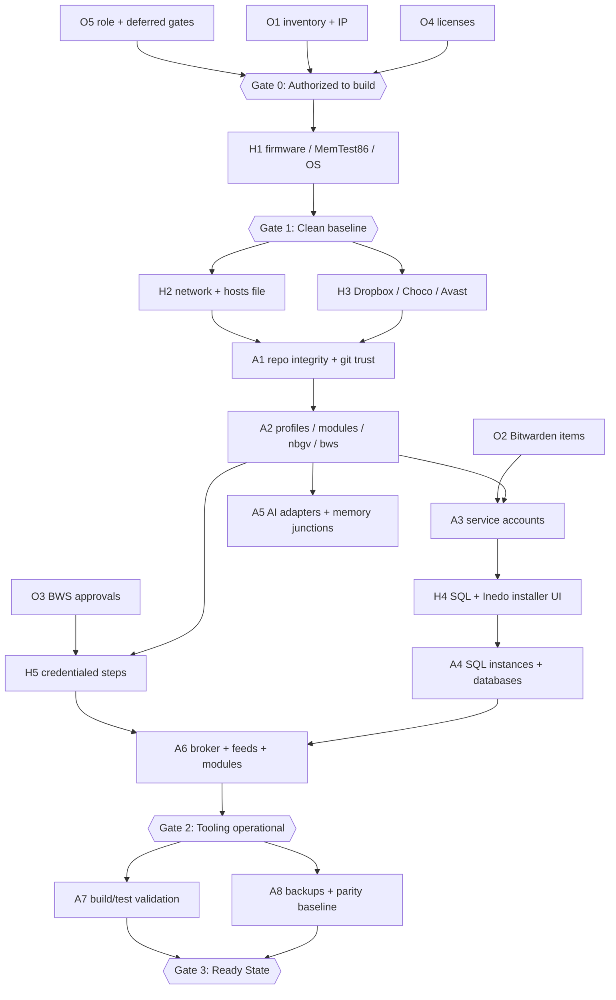
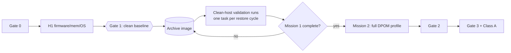

# Runbook: New Computer Provisioning (Parallel Streams)

## Purpose

Provision a new Windows 11 host into the ATAP organization as a set of **parallelizable
streams** rather than a single linear read-through. Each stream declares its owner
(human-manual or agent-automated), its entry gate, its exit evidence, and what it blocks.

This runbook is the _execution plan_. It does not restate procedure. Every step points at
the canonical procedure in [NewComputerSetup.md](NewComputerSetup.md), which remains the
source of truth for **how**; this document owns **who, when, and in parallel with what**.

> **Relationship to existing documents.** [NewComputerSetup.md](NewComputerSetup.md) is
> canonical for all overlapping content. [NewComputerSetupUsingAnsible.md](NewComputerSetupUsingAnsible.md)
> is retained for BIOS, OS-install, and Ansible-bootstrap notes only. Where any of the
> three disagree, `NewComputerSetup.md` wins.

## Scope and audience

- **Human operator (H)** — physically present or console-bound work: firmware, OOBE,
  installer UI, browser-based admin panels, credential entry, and every decision requiring
  human authority.
- **Agent (A)** — an AI agent or scripted automation running unelevated PowerShell 7 with
  profiles loaded. Agents never enter credentials and never make an authorization decision.
- **Organization (O)** — work that is not on the new host at all: inventory records, DHCP
  reservations, Bitwarden collection entries, feed/ACL grants, and senior approvals.

## How to use this runbook

1. Read **Streams and dependencies** to see what can run concurrently.
2. Pick the **profile** for the host from _Host profiles_ — it selects which streams apply.
3. Work each stream against the linked canonical section.
4. Do not cross a **Gate** until every listed exit condition has recorded evidence.

## Non-negotiable conventions

These apply to every stream and are not restated per-step.

- **Parity journal.** Before any step changes state on a host that has a parity peer,
  append a secret-safe `Add-ParityChangeEntry` on the host being changed; the peer
  acknowledges with `Confirm-ParityChangeApplied` after applying its action. See
  [NewComputerSetup.md § Important Conventions](NewComputerSetup.md).
- **Evidence goes to `_generated/`** (SC-0033), metadata only — never secret values,
  never database contents.
- **Claims are separable from evidence.** Every exit condition below is either tagged with
  the command that proves it or marked plainly as asserted.
- **SecretName only.** Callers reference secrets by `SecretName` and resolve through
  `Get-SecretATAP`. Use the dotted `<ServiceName>.<Purpose>.<HostName>` form for
  host-specific Bitwarden items; for example, `SvcSQLServer.Login.ncat040` and
  `SvcProGet.Login.ncat040`. No API-key environment variables, no connection strings in
  files.
- **PowerShell 7 with profiles.** Never `-NoProfile` except where a step is explicitly
  auditing no-profile resolution (Steps 4.4 and 4.6 do exactly that, on purpose).

---

## Streams and dependencies

| Stream | Owner | Title                                                                           | Canonical section        | Blocks     |
| ------ | ----- | ------------------------------------------------------------------------------- | ------------------------ | ---------- |
| **O1** | O     | Compute-inventory row, IP assignment, DHCP reservation                          | § 9.10b                  | H2, A5     |
| **O2** | O     | Bitwarden `ComputerLogins` items for the host's service accounts                | § 5                      | A3         |
| **O3** | O     | BWS ReadOnly identity approvals (HITL, Tasks 13.40–13.43)                       | § 9.4                    | A6         |
| **O4** | O     | Licenses: Windows key, Inedo free/licensed keys, Syncfusion                     | § 9.1                    | H4         |
| **O5** | O     | Host-role decision and deferred-gate review (Java `SC-0286`, prod-data 13.60)   | § Current architecture   | Gate 0     |
| **H1** | H     | Firmware, MemTest86, OS install, machine identity                               | § 0, § 1                 | everything |
| **H2** | H     | Network: private profile, WinRM bootstrap, hosts file, IPv6 sanity              | § 9.10a, § 9.10b         | A1         |
| **H3** | H     | Interactive installs: Dropbox, Chocolatey seed, Avast Web Guard scoping         | § 2, § 2.3.1             | A2         |
| **H4** | H     | Installer-UI work: SQL Server setup, Inedo Hub, ProGet/BuildMaster admin panels | § 6.3, § 9.1, § 9 Step 9 | A7         |
| **H5** | H     | Credentialed steps: service-account passwords, API keys, GitHub PAT             | § 5, § 9.4, § 11.4       | A6, A8     |
| **A1** | A     | Dropbox settle verification, repo/worktree integrity, exact Git trust           | § 3                      | A2         |
| **A2** | A     | Profiles, PSGallery modules, `nbgv`, `bws` machine-wide                         | § 4                      | A4, A6     |
| **A3** | A     | Local service accounts via `New-LocalServiceAccount`                            | § 5                      | H4         |
| **A4** | A     | SQL instances, TCP ports, memory caps, database builds                          | § 6, § 7, § 8            | A7         |
| **A5** | A     | AI adapter renders, MCP registrations, memory junctions                         | § 9.11, § 11.5           | —          |
| **A6** | A     | Elevated install broker, ProGet feed registration, ATAP module install          | § 9a, § 9.8, § 9.9       | A7         |
| **A7** | A     | Build/test validation of stable branches, packaging, feed round-trip            | § 11.1–11.3              | Gate 3     |
| **A8** | A     | Backups (Cobian), SystemParityMonitor, parity audit baseline                    | § 9.10, § 10             | Gate 3     |

### Dependency graph



### What genuinely runs in parallel

- **O1–O5** run entirely ahead of the host and in parallel with each other.
- **H2 and H3** are independent of one another once Gate 1 passes.
- **A5** is independent of the whole SQL/Inedo chain — it can complete while H4 is still in
  an installer dialog.
- **A7 and A8** are independent of each other after Gate 2.
- **A3** depends only on O2 plus a working `ATAP.Utilities.PowerShell` import, not on SQL.

### What must not be parallelized

- **A2 before A1.** Profiles resolve paths from a synced, integrity-checked tree. Rendering
  profiles over an unsettled Dropbox produces conflicted copies that look like drift.
- **A6 before A2.** The broker installs modules AllUsers; it must be provisioned from the
  git clone before the module-install machinery works (§ 9a, "Bootstrap order matters").
- **A4 before A3.** SQL setup binds the Database Engine and Agent to `SvcSQLServer`,
  which must already exist with `SeServiceLogonRight`.
- **Any agent work before Gate 1** on a host whose purpose is clean-host validation. See
  the ncat040 appendix.

---

## Gates

### Gate 0 — Authorized to build

Exit conditions:

1. Host role, name, and IP are recorded in the canonical compute inventory, and the router
   DHCP reservation agrees. _(Evidence: inventory diff in `ATAP.IAC`.)_
2. The name resolves from the `ATAP.IAC` hosts template, not from an ad-hoc local edit.
3. Applicable deferred gates are **named**, not silently assumed closed: Java `SC-0286`,
   BWS identity 13.40–13.43, profiled-remoting 13.20.e, production-data 13.60.
4. Licenses are on hand.

### Gate 1 — Clean baseline

Exit conditions:

1. MemTest86: zero errors across four or more consecutive passes, at the memory profile the
   host will actually run. _(Evidence: `MemTest86.log` metadata + the profile tested.)_
2. Windows reaches 24H2 build 26200 or later; machine name, timezone, and private network
   profile are set and verified with `$env:COMPUTERNAME`.
3. First local account confirmed in **Administrators**.
4. Parity journal records the MemTest86 outcome (§ 0.7).

> **Snapshot opportunity.** If the host will be used for clean-host validation, take the
> image/snapshot **here**, before Gate 1's exit hands off to H2/H3. This is the last moment
> the machine is a stock Windows install with a known-good memory result.

### Gate 2 — Tooling operational

Exit conditions:

1. ProGet answers on `50000`; BuildMaster answers on `50017`; both reachable **by hostname**
   over every address the name resolves to, with no TIMEOUT row (§ 9.10a).
2. `Web.BaseUrl` includes the custom port; a feed probe returns `200`, not `302`.
3. A fresh shell resolves `nbgv` and `bws` both with and without a profile.
4. One `Get-SecretATAP` resolution succeeds with the value discarded.
5. Exact-path `safe.directory` entries exist for `SvcBuildMaster`; no parent-wide entry.

### Gate 3 — Ready State

Use the ten-item checklist in [NewComputerSetup.md § Ready State](NewComputerSetup.md).
Do not restate it here; do not mark it satisfied by summary.

---

## Stream detail

Each stream lists its entry gate, the canonical sections it executes, and its exit evidence.
Where a stream is agent-owned, the **agent handoff** line states what the agent must be given
and what it must never do.

### O1 — Compute inventory and addressing

- **Entry:** none.
- **Execute:** add the host to the `ansibleInventory` compute-inventory model in `ATAP.IAC`;
  add the name/IP pair to `Windows/NetworkResources/Hosts IP addresess.txt`; create the DHCP
  reservation on the router.
- **Exit:** the template contains the entry, and the reservation matches. A manual edit to
  any live workstation `hosts` file without mirroring it back here will be overwritten on the
  next deployment.

### O2 — Bitwarden service-account items

- **Entry:** O1 (host name is fixed).
- **Execute:** create in the `ComputerLogins` collection, each with username and password:
  `SvcSQLServer.Login.<hostname>`, `SvcProGet.Login.<hostname>`,
  `SvcBuildMaster.Login.<hostname>`, plus `SvcAnsibleAdmin.Login.<hostname>` if the
  elevated install broker will run on this host. The first field is the service name, the
  middle field is the credential purpose, and the final field is the host name.
- **Exit:** each item resolves by `SecretName` through `Get-SecretATAP` from an authorized
  identity. _(Evidence: resolution succeeded, value discarded.)_

### O3 — BWS ReadOnly identity approvals

- **Entry:** O5.
- **Execute:** the allowlist is exact — `SvcBuildMaster`, `SvcProGet`, `SvcSQLServer`, each
  scoped to project `CI-Shared`, purpose `ReadOnly`. `SvcSeq`, `SvcParityAudit`, and
  `ansibleAdmin` receive no BWS token.
- **Exit:** approval recorded under Tasks 13.40–13.43. **This is a HITL gate; an agent may
  not create accounts, certificates, grants, tokens, logon rights, or scheduled tasks here.**

### O4 — Licenses

- **Execute:** Windows activation key printed/recorded; Inedo license keys available for the
  Inedo Hub prompts; any additional component licenses the host's role requires.

### O5 — Role decision and deferred-gate review

- **Execute:** decide the host's role(s) and record which deferred gates are in play. A host
  that will never run Inedo products skips H4/A6's Inedo halves entirely; a host that will
  run Flyway inherits the open Java decision (`SC-0286`).
- **Exit:** a written role record naming the applicable streams and open gates.

### H1 — Firmware, memory, OS, identity

- **Entry:** Gate 0.
- **Execute:** § 0 (MemTest86, all of 0.1–0.7), § 1 (install, name, timezone, private
  network, admin verification, Windows Update to current).
- **Exit:** Gate 1.
- **Note:** BIOS specifics are per-machine; see
  [NewComputerSetupUsingAnsible.md](NewComputerSetupUsingAnsible.md) for the pattern used on
  `utat022` and adapt — do not copy its slot/controller settings blindly.

### H2 — Network bootstrap and name resolution

- **Entry:** Gate 1, O1.
- **Execute:** private-network discovery/sharing; WinRM bootstrap if the host will be Ansible
  managed; deploy the hosts template (§ 9.10b, elevated, back up the live file first, then
  `Clear-DnsClientCache`); run the IPv4/IPv6 reachability probe (§ 9.10a) once services exist.
- **Exit:** every address the hostname resolves to either connects or is deliberately
  removed/deprioritized. A dead global IPv6 address is a _host networking_ defect — fix the
  network, never `BuildMaster.config`, `ProGet.config`, or `ServicePlacementMap`.

> **Remote-access note.** WinRM listening on 5985/5986 is not the same as being reachable:
> a non-domain client also needs the host in its `TrustedHosts`, or an HTTPS/5986 connection
> with a validating certificate. Record which of the two this host is provisioned for.

### H3 — Interactive installs

- **Entry:** Gate 1.
- **Execute:** Dropbox **first and manually** (Chocolatey is not yet available and the
  package manifest lives under Dropbox); then Chocolatey (§ 2.1) and the approved package
  set (§ 2.2); Sysinternals Suite pinned via WinGet (§ 2.3); Avast Web Guard restricted to
  browser processes only (§ 2.3.1); Python 3.11 only if Manim or Copilot code execution is
  in the host's role.
- **Exit:** `pwsh`, `git`, `code`, `dotnet --list-sdks`, `bw` all report versions; Avast is
  browser-scoped and a PKI probe shows the ATAP Foundation leaf, not an Avast Shield
  certificate. An HTTP 200 alone is **not** sufficient PKI evidence.

### H4 — Installer-UI work

- **Entry:** A3 (service accounts exist), O4.
- **Execute:** SQL Server setup UI — Database Engine and Agent both as `SvcSQLServer`,
  automatic startup, Windows authentication (§ 6.3); TCP/IP enabled with the fixed port and
  dynamic ports cleared (§ 6.5); Inedo Hub installs (§ 9.1); ProGet `Web.BaseUrl` set to
  scheme + hostname + port (§ 9 Step 9 — this is a guaranteed blocker on every new machine);
  BuildMaster raft assignment (§ 9.7).
- **Exit:** services running under the intended accounts; `Web.BaseUrl` probe returns `200`.

### H5 — Credentialed steps

- **Entry:** O3, A2.
- **Execute:** service-account password entry; the bounded BWS ReadOnly bootstrap (§ 9.4,
  dry-run with `-WhatIf` first, then execute, then remove the envelope); ProGet admin API key
  creation; GitHub PAT for MCP (§ 11.4).
- **Exit:** validation runs as the owning account and records **only** account, host,
  project, purpose, module version/path, operation ID, redacted status, and DPAPI file
  path/hash.
- **Agent handoff:** none. An agent may prepare the command line and review the `-WhatIf`
  output; a human runs it. Never place a token in an argument, environment variable,
  transcript, log, or evidence artifact.

### A1 — Repository integrity and Git trust

- **Entry:** H3 (Dropbox installed).
- **Execute:** wait for Dropbox `Up to date`; inventory host-local mutable state and keep it
  out of Dropbox/Git; scan for `*conflicted copy*` files and unexpected reparse points;
  verify the six stable repos exist; verify sprint worktrees if joining an active sprint
  (§ 3). Confirm `.vscode` is the only intended junction and `.agents`/`.claude`/`.codex`/
  `.gemini` are concrete renders. Map shell folders (§ 3.1) and sign out/in.
- **Exit:** every Git trust entry is an **exact** authorized path. Trusting
  `C:\Dropbox\whertzing\GitHub` as a single parent is prohibited; wildcards are not accepted.
- **Agent handoff:** an agent may run every check and report. An agent must **not** run
  SprintStart a second time to join an active sprint — use the machine-local boundary
  retarget.

### A2 — Profiles and machine-wide tooling

- **Entry:** A1.
- **Execute:** § 4.1–4.6 — profile source from the ATAP.IAC template via HostSettings;
  `Set-UserScopeProfile` for developer and service-account classes (never a symlink, never a
  hand copy); PSGallery modules at `-Scope AllUsers` from an elevated shell; `nbgv` to
  `C:\ProgramData\dotnet\tools`; `bws` to `C:\Program Files\Bitwarden\bws` with the install
  dir appended to the **Machine** `PATH`.
- **Exit:** in a **brand-new** shell (not a child of the install session, which inherits a
  stale environment block), both of these resolve for `nbgv` and `bws`:

  ```powershell
  pwsh -NoProfile -Command "(Get-Command bws -ErrorAction SilentlyContinue).Source"
  pwsh -Command            "(Get-Command bws -ErrorAction SilentlyContinue).Source"
  ```

  The `-NoProfile` line is the load-bearing one — it proves service-account and
  scheduled-task contexts can resolve the binary.

- **Gate note:** the profiled-remoting fix (13.20.e) is deferred. The explicit
  `WithProfiles.pssc` registration is a bounded workaround; do not report it as the
  installed fix.

### A3 — Local service accounts

- **Entry:** O2, A2.
- **Execute:** `New-LocalServiceAccount` with `-GrantSeServiceLogonRight` for each account in
  the host's role (§ 5), plus `SvcAnsibleAdmin` if the broker will run here.
- **Exit:** `Status = Success`, `UserCreated = True`, `SeServiceLogonRight = True` per
  account.

### A4 — SQL Server instances and databases

- **Entry:** H4.
- **Execute:** § 6.2 base instances `Production` (50020), `QA` (50025), `Integration` (50030)
  driven from the host's SQL topology row in `$global:settings` — never from path or port
  literals; § 6.6 `max server memory` cap on every instance; § 7 sprint/feature instances
  (`DevWhertzing` 50035, `ExpWhertzing` 50040); § 8 build `ATAPUtilities` on all instances.
- **Exit:** every instance answers `SELECT @@SERVERNAME`; data/log/backup paths match the
  settings-backed `C:\LocalDBs\<INSTANCE_NAME>\` convention; each instance's data
  classification is recorded.

### A5 — Agent surfaces (independent lane)

- **Entry:** A2.
- **Execute:** confirm rendered AI adapter surfaces match the host assignment; create the AI
  memory junctions (§ 9.11) — **two per repository**, one for the main-repo slug and one for
  the active sprint-worktree slug; register the five DAB MCP servers (§ 11.5) and the GitHub
  MCP token (§ 11.4, credential from H5).
- **Exit:** `/checkpoint` reports `MemorySnapshotCreated: true` with a non-zero
  `MemoryFileCount`. A missing junction fails **silently** — a checkpoint that archives zero
  memory files still exits successfully, so this positive check is required.
- **Note:** junctions are host-local and do not sync; every new host needs them even though
  the memory content arrives by Dropbox.

### A6 — Broker, feeds, and module install

- **Entry:** A2, A3, A4, H5.
- **Execute:** provision the elevated install broker **from the git clone, not an installed
  module** (§ 9a; see also
  [Runbook-ElevationBroker-PeerHost.md](Runbook-ElevationBroker-PeerHost.md)); register
  `powershellget-stable` ahead of PSGallery and install the ATAP modules (§ 9.8); register
  the remaining ProGet feeds (§ 9.9); grant service-account database rights and package-store
  ACLs (§ 9.2, § 9.2.1, § 9.3.1); bootstrap exact Git trust as `SvcBuildMaster` (§ 9.5).
- **Exit:** Gate 2.
- **Note:** the broker's registration has two load-bearing properties that must not be
  "tidied up" — no repeating time trigger, and `MultipleInstancesPolicy = Queue`.

### A7 — Build and test validation

- **Entry:** Gate 2.
- **Execute:** § 11.1–11.3 — stable-branch restore/build/test for ATAP.Utilities and
  AceCommander, Pester suites with profiles enabled, packaging and feed round-trip. On a
  sprint branch pass `-p:PackageLifeCycleStage=Sprint` consistently across split and combined
  flows and preserve the `ATAP5TIER001` guard; omit the override on `main`.
- **Exit:** all green, with the command output retained in `_generated/`.

### A8 — Backups and parity baseline

- **Entry:** Gate 2.
- **Execute:** § 9.10 SystemParityMonitor configuration; § 10 Cobian jobs — weekly full,
  then nightly differentials; capture an `Invoke-ParityAudit` baseline snapshot.
- **Exit:** backup contents live outside Git and Dropbox; evidence is metadata only (path
  identity, size, hash, timestamp, verification outcome) — never database contents.

---

## Host profiles

Select one; it determines which streams apply.

| Profile                        | Streams                                            | Notes                                                            |
| ------------------------------ | -------------------------------------------------- | ---------------------------------------------------------------- |
| **Full developer workstation** | all                                                | The `utat022`/`utat01` shape.                                    |
| **Clean-host validator**       | O1, O2 (deferred), O5, H1, H2 → **stop at Gate 1** | Deliberately minimal. See the ncat040 appendix.                  |
| **Build/test target**          | O1, O5, H1, H2, H3, A1, A2, A4, A7                 | No Inedo products; consumes feeds from a peer.                   |
| **Mobile / DPOM-capable**      | all, plus § 11.6                                   | Adds Class A off-LAN certification and the bounded return drill. |

---

## Appendix A — Instance plan for `ncat040`

`ncat040` has **two sequential missions**, and they conflict. Mission 1 requires the host to
stay unprovisioned; Mission 2 requires it fully provisioned. Running the streams in the
normal order destroys Mission 1 permanently. Plan accordingly.

### Mission 1 — clean-host validation

**Purpose:** validate tasks whose acceptance criterion is "works on a clean host" — that is,
tasks which may be silently passing on `utat022`/`utat01` only because of accumulated
undeclared state (a stray `PATH` entry, a per-user module, a leftover trust entry, an
already-warm Dropbox tree).

**Execute:** O1, O5, H1, H2 → **stop at Gate 1**. Do not run H3, A1, or anything downstream.

**Critical constraints:**

1. **Take a restorable image immediately after Gate 1**, before any validation run. Every
   clean-host validation is one-shot: the first run that installs anything ends the clean
   state. Without an image, the second task to need a clean host requires a full OS reinstall.
2. **One task per restore cycle.** Restore the image, run one task's clean-host validation,
   capture evidence, restore again. Batching two tasks means task 2 ran on task 1's residue
   and proves nothing.
3. **Capture the pre-run baseline** so "clean" is a measured claim rather than an assertion:

   ```powershell
   # Metadata-only baseline; write under _generated/ per SC-0033.
   $out = Join-Path $repoRoot '_generated\ncat040-clean-baseline'
   New-Item -ItemType Directory -Path $out -Force | Out-Null

   [Environment]::GetEnvironmentVariable('Path','Machine') -split ';' |
     Set-Content (Join-Path $out 'machine-path.txt')
   Get-Module -ListAvailable | Select-Object Name, Version, ModuleBase |
     Export-Csv (Join-Path $out 'modules.csv') -NoTypeInformation
   Get-ChildItem 'C:\Program Files','C:\ProgramData' -Directory -ErrorAction SilentlyContinue |
     Select-Object FullName | Export-Csv (Join-Path $out 'installed-roots.csv') -NoTypeInformation
   git config --global --get-all safe.directory 2>$null |
     Set-Content (Join-Path $out 'git-trust.txt')
   ```

4. **`ncat040` has no parity peer during Mission 1.** The parity-journal convention is
   written around the `utat022`/`utat01` pair. Journal `ncat040`'s changes locally for the
   audit trail, but do not invent a peer action for a host that has none. Revisit at Mission 2.
5. **H2's WinRM decision is now load-bearing.** Remote agent access to `ncat040` is itself
   host state. If clean-host validation must run over a remote session, WinRM configuration
   is part of the baseline and must be captured in the image and declared in the evidence —
   otherwise "clean" quietly means "clean except for the way we got in."

**Exit evidence per validation run:** the task ID validated, the restore-point identity, the
pre-run baseline hash, the command run, and the outcome. Metadata only.

### Mission 2 — DPOM and testing host

**Entry:** Mission 1 is complete and the clean-host image is archived (or explicitly retired
by decision — say which).

**Execute:** the **Mobile / DPOM-capable** profile: all streams, plus § 11.6 Class A
certification.

**Additional requirements beyond the full-workstation profile:**

1. **Parity pairing decision (O5, revisited).** Decide `ncat040`'s parity relationship before
   A8. It is a third host in a design written for a pair — either pair it explicitly with one
   named peer, or record that it is unpaired and that `Compare-ParityAudits` drift against it
   is not meaningful. Do not leave this implicit.
2. **DPOM primary-role marker.** `Set-ParityPrimaryRole` writes one canonical shared record
   at `C:\Dropbox\whertzing\ATAP\ParityState\PrimaryRole.json`. It requires explicit human
   authorization and a parity-journal entry ID. Adding a third host to a single shared marker
   needs a decision recorded **before** the first DPOM entry, not during it.
3. **Class A certification (§ 11.6)** — BitLocker with protection on, anti-malware current,
   time synchronized; sleep/hibernate and battery-sensitive task review; NordVPN kill switch
   and trusted-network rule tested; local SQL and Inedo health; one value-discarding
   SecretName resolution; representative restore/build/test; GitHub auth; Dropbox continuity;
   a live off-LAN gate; and a bounded return drill.
4. **Class B / full-offline secret use is not implied by a Class A pass.** State the class
   achieved; do not generalize.
5. **Never copy Inedo databases** between hosts. The return drill transfers immutable
   packages by hash and reconstructs BuildMaster outcomes; independent Inedo databases stay
   independent.
6. **Backups before DPOM.** Write classified `COPY_ONLY` backups with `CHECKSUM` under
   `C:\LocalDBs\PRODUCTION\Backup` and run `RESTORE VERIFYONLY` before extended DPOM.

### Sequencing summary for `ncat040`



---

## Open items carried by this runbook

These are named, not resolved. Do not treat any of them as closed by the existence of this
document.

1. **`ncat040` parity relationship** — undecided (Mission 2 requirement 1).
2. **Third-host `PrimaryRole.json` semantics** — the marker is a single shared record;
   three-host behavior is unspecified (Mission 2 requirement 2).
3. **Clean-host image storage location and retention** — undecided; it is large, must stay
   out of Git and Dropbox, and needs a stated retention policy.
4. **Java vendor/version/update owner** — deferred to `SC-0286`.
5. **BWS identity provisioning** — deferred to Tasks 13.40–13.43 (HITL).
6. **Profiled-remoting source/runtime-state fix** — deferred to Task 13.20.e; the
   `WithProfiles.pssc` registration remains a bounded workaround.
7. **Production-data policy** — deferred to Task 13.60.
8. **Custom organization image** — the _Creating a Custom Windows 11 Organization Image_
   explainer is still unwritten; this runbook assumes an OEM image (Option A).
