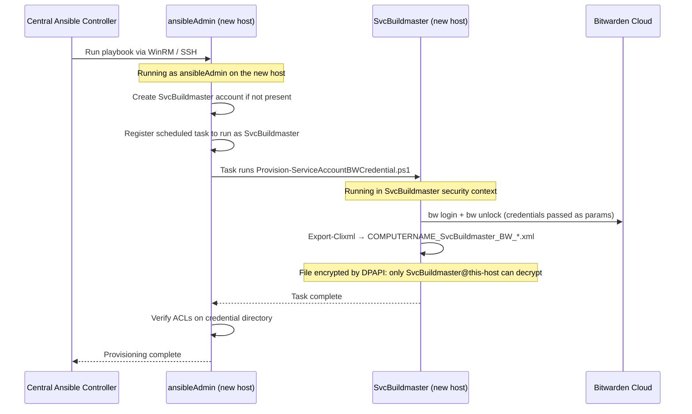

# Service Accounts and Bitwarden

**Created:** 2026-05-25
**Status:** In Progress — Research Phase
**Sprint:** Sprint-0007
**Source Plan:** `_Planning/Plan_AccessingBitwardenFromServiceAccounts.md`

---

## Purpose

This document records research findings, decision drivers, considered alternatives,
decision outcomes, rationale, and trade-offs for the problem of providing Bitwarden
vault access to long-running Windows service accounts that start at computer boot,
before any interactive user logon.

---

## Context

Several ATAP ecosystem services run as dedicated Windows service accounts:

| Service                 | Windows Service Account |
| ----------------------- | ----------------------- |
| BuildMaster             | `SvcBuildmaster`        |
| ProGet                  | `SvcProGet`             |
| Jenkins                 | `JenkinsAgentSrvAcct`   |
| SEQ (log listener)      | `SeqDefaultInstance`    |
| Ansible (AWX/Semaphore) | `ansibleAdmin`          |

All of these services need to read secrets from the Bitwarden vault — for example,
database connection credentials, API keys, and inter-service authentication tokens.

### Existing Infrastructure

Two PowerShell cmdlets exist in `ATAP.Utilities.Security.Powershell`:

- **`Get-BitWardenCredential`** — Loads or creates DPAPI-encrypted credential files on disk.
  File paths follow the pattern `<CredentialDirectory>\<COMPUTERNAME>_<USERNAME>_BW_Login_Credential.xml`
  and `<CredentialDirectory>\<COMPUTERNAME>_<USERNAME>_BW_Unlock_Credential.xml`.
  Uses `Export-Clixml` / `Import-Clixml` (Windows DPAPI at rest).

- **`Get-BitwardenSecret`** — Retrieves a named secret from the Bitwarden vault using
  the `Microsoft.PowerShell.SecretManagement` module and a registered `Bitwarden` vault.
  Requires `BW_SESSION` to be set and valid.

- **`Initialize-BitwardenSession`** (`LoginScript.ps1`) — Called at interactive user logon.
  Reads DPAPI credential files, logs in with `bw login`, unlocks with `bw unlock --raw`,
  and stores the resulting session token.

---

## R-01: Bitwarden Session Lifecycle (Audit)

**Completed:** 2026-05-25

### How BW_SESSION is Set for Interactive Users

The session is initialized by `Initialize-BitwardenSession` in
`src\ATAP.Utilities.PowerShell\Profiles\LoginScript.ps1`.

The call sequence is:

1. `Get-BitWardenCredential` reads two DPAPI `.xml` credential files from disk and
   returns a hashtable with `LoginCredential` and `UnlockCredential` entries.
2. `bw status` is called to check whether the CLI is already authenticated.
3. If not authenticated, `bw login <email> --passwordenv BW_PASSWORD` is called,
   passing the login password via environment variable (immediately removed after the call).
4. `bw unlock --raw --passwordenv BW_PASSWORD` is called using the master/unlock password
   via environment variable (immediately removed after the call).
5. The resulting session key (raw base64 token) is written to **two** scopes:
   - Process scope: `$env:BW_SESSION = $sessionKeyStr`
   - User scope: `[System.Environment]::SetEnvironmentVariable('BW_SESSION', $sessionKeyStr, 'User')`

The session key observed on the current machine (`utat022`, user `whertzing`) is **88 characters** long.

### BW_SESSION Storage Today

| Scope           | How written                                                                          | Notes                                                               |
| --------------- | ------------------------------------------------------------------------------------ | ------------------------------------------------------------------- |
| Process         | `$env:BW_SESSION = $sessionKeyStr`                                                   | Only visible to the current process and its children                |
| User (registry) | `[System.Environment]::SetEnvironmentVariable('BW_SESSION', $sessionKeyStr, 'User')` | Persists in HKCU; visible to new processes spawned as the same user |

Agent-spawned shells do not inherit `$env:BW_SESSION` from the interactive session.
The Bitwarden instructions (`Bitwarden.instructions.md`) explicitly document this
and recommend reading via:

```powershell
$bwSession = [System.Environment]::GetEnvironmentVariable('BW_SESSION', 'User')
```

### Token TTL and Non-Interactive Renewal

The Bitwarden CLI (`bw 2026.4.1`) does not embed an expiry timestamp in the token
string itself. Token validity is governed by the **Bitwarden server-side session
timeout** configured in the organization's Bitwarden settings (not exposed by the
CLI help text).

Key behaviors documented by the CLI:

- `bw unlock --check` — exits 0 if the vault is currently unlocked, non-zero otherwise.
- Running `bw unlock` again immediately invalidates all previous session keys ("After
  unlocking, any previous session keys will no longer be valid.").
- `bw status` returns a JSON object; the `status` field is `"unlocked"` when a valid
  `BW_SESSION` is active, `"locked"` when authenticated but locked, or
  `"unauthenticated"` when not logged in.
- There is no `--refresh` or token-renew command; renewal requires a full `bw unlock`.

The CLI supports three methods for passing the master password non-interactively:

```text
bw unlock [password]                          # password as positional arg (visible in process list)
bw unlock --passwordenv <ENV_VAR_NAME>        # password in environment variable (preferred)
bw unlock --passwordfile <path>               # password as first line of a file
```

### bw unlock Command Signature

```text
bw unlock [options] [password]

Unlock the vault and return a new session key.

Options:
  --check                        Check lock status.
  --passwordenv <passwordenv>    Environment variable storing your password
  --passwordfile <passwordfile>  Path to a file containing your password as its first line
  --raw                          Return only the session key (no surrounding text)
  -h, --help                     display help for command
```

Exit codes:

| Exit Code | Meaning                                                    |
| --------- | ---------------------------------------------------------- |
| 0         | Success — session key written to stdout (with `--raw`)     |
| Non-zero  | Failure (wrong password, network error, CLI not logged in) |

### R-01 Findings Summary

- **BW_SESSION is set at interactive logon** via `LoginScript.ps1`; service accounts
  that start at boot have no equivalent logon trigger.
- **Token is stored in user-scope registry** (HKCU), making it available to new
  processes run as the same interactive user — but unavailable to a different service
  account user.
- **Non-interactive unlock is fully supported** via `--passwordenv` or `--passwordfile`.
- **Token expiry is server-configured**, not embedded in the token; the CLI provides
  `bw unlock --check` to test validity before use.
- **Re-unlocking invalidates prior tokens**, so coordinated refresh is important
  in multi-process environments.

---

## R-02: DPAPI Credential File Approach for Service Accounts (Evaluation)

**Completed:** 2026-05-25

### DPAPI User-Scope Confirmation

Windows DPAPI (`Export-Clixml` / `Import-Clixml`) encrypts data using a key derived from
the **current Windows user's credentials** and is bound to the **current computer**.
A credential file created while running as `SvcBuildmaster` on `utat022` can only be
decrypted by `SvcBuildmaster` **on that same host**. This is a hard cryptographic
guarantee — no other user account, even a local administrator, can read the plaintext.

This means:

- Each service account needs its **own credential files** on each host where it runs.
- Provisioning must occur in a process running **as that service account** (via `RunAs`,
  PsExec, or a bootstrapping scheduled task).
- Migrating a service to a new host requires re-provisioning credentials on the new host.

### Review of Get-BitWardenCredential for Non-Interactive Use

Code inspection of
[`Get-BitWardenCredential.ps1`](../src/ATAP.Utilities.Security.Powershell/public/Get-BitWardenCredential.ps1)
reveals the following:

| Aspect                          | Finding                                                                                                                                                                                                               |
| ------------------------------- | --------------------------------------------------------------------------------------------------------------------------------------------------------------------------------------------------------------------- |
| Interactive prompts             | **None.** No `Read-Host` or `Get-Credential` GUI calls. Passwords are accepted only as plain-text parameters.                                                                                                         |
| Required params when creating   | `BitWardenUserName`, `BitWardenLoginPassword`, `BitWardenUnlockPassword` — all accepted as strings.                                                                                                                   |
| Existing-file path              | If both `.xml` files already exist and `-Replace` is not set, the function loads from disk and returns — no input needed.                                                                                             |
| Missing `-NonInteractive` guard | If credential files are absent and required parameters are omitted, the function throws a terminating error with a clear message. This is safe but the error message could be more actionable for automated contexts. |
| `-Replace` flag                 | Creates date-stamped backups before overwriting; fully non-interactive.                                                                                                                                               |

**Conclusion:** `Get-BitWardenCredential` can be called from a service account context
without modification when credential files already exist. When called for the first time
(provisioning), all required parameters must be supplied by the caller — there is no
interactive fallback. A dedicated `-NonInteractive` switch (D-03) is recommended to make
the failure mode explicit rather than relying on parameter validation errors.

### Credential Directory Path Assessment

The default credential directory is `C:\Dropbox\Security\Credentials`. This path is
**unsuitable for service accounts** because:

1. Dropbox synchronization software does not run under Windows service accounts
   (`SvcBuildmaster`, `SvcProGet`, etc.).
2. Service accounts typically do not have a Dropbox folder.
3. NTFS ACLs on `C:\Dropbox\` may not grant access to service accounts.

**Recommended alternative:** `C:\ProgramData\ATAP\BitwardenCredentials\<ServiceAccount>\`

This path:

- Exists on all Windows hosts regardless of Dropbox configuration.
- Is accessible to service accounts that have been granted read/write ACL to the folder.
- Keeps credential files separated per service account.
- Allows ACL hardening so only the owning service account can read its own file.

### Credential File Naming

Current naming convention: `<COMPUTERNAME>_<USERNAME>_BW_Login_Credential.xml`

This is appropriate — it naturally separates credentials by host and by user account,
which is required because DPAPI binds to both.

### Provisioning Workflow Requirements

Provisioning credential files for a service account requires:

1. A one-time interactive session **running as the service account** (or a RunAs
   call that executes the provisioning script in the service account's security context).
2. Passing the Bitwarden email, login password, and master password as parameters.
3. Writing the DPAPI-encrypted `.xml` files to the service-account-specific credential
   directory.

Practical provisioning methods:

| Method                                                          | Notes                                                                                  |
| --------------------------------------------------------------- | -------------------------------------------------------------------------------------- |
| `PsExec -u SvcBuildmaster -p <pwd> pwsh -File Provision-...ps1` | Requires the service account password. Works from a privileged admin session.          |
| Task Scheduler (Run As service account, trigger once)           | Clean; runs in the service account context. Requires planting the provisioning script. |
| Ansible `win_scheduled_task` + `win_command`                    | Idempotent; integrates with existing IAC. Preferred for fleet deployments.             |

### Risk Assessment

| Risk                     | Description                                                                                                                        | Mitigation                                                                                   |
| ------------------------ | ---------------------------------------------------------------------------------------------------------------------------------- | -------------------------------------------------------------------------------------------- |
| Credential file rotation | If the Bitwarden master password changes, existing `.xml` files must be re-provisioned.                                            | Provisioning script with `-Replace` flag; Ansible playbook for fleet rotation.               |
| Account password changes | If the service account Windows password changes, DPAPI keys are re-derived on next logon; existing `.xml` files become unreadable. | Re-provision after any service account password change.                                      |
| Host changes             | Credential files are host-bound. New hosts require new provisioning runs.                                                          | Include provisioning in the new-host Ansible playbook.                                       |
| File ACL exposure        | If `C:\ProgramData\ATAP\BitwardenCredentials\` has overly broad ACLs, other accounts could access the files.                       | Harden ACLs to grant read/write only to the owning service account. Document in the runbook. |
| Backup files             | The `-Replace` path writes timestamped `.bak` files containing DPAPI-encrypted data alongside the main files.                      | Backup files are equally DPAPI-protected; consider a retention policy to delete old backups. |

### ansibleAdmin First-Boot Provisioning: Minimal Blast Radius Model

**Added:** 2026-05-25 — in response to design question raised during R-02 analysis.

#### The Insight

The standard objection to DPAPI credential files for service accounts is:
_"Provisioning requires an interactive session as the service account — which is
impractical on a freshly imaged machine."_

However, the ATAP ecosystem already has a privileged account — `ansibleAdmin` — that is
provisioned during the **Windows first-boot setup** of every new computer and is called
by the **central Ansible controller** as part of host onboarding. This account can run
PowerShell scripts in the security context of any local service account (via a scheduled
task or `Start-Process -Credential`), which means it can create DPAPI credential files
**for each service account**, scoped to **that specific computer**, without any
interactive logon by a human.

#### Why This Gives the Smallest Possible Blast Radius

Windows DPAPI binds the encryption key to the tuple `(Windows user identity, computer
identity)`. A credential file created as `SvcBuildmaster` on host `HOST-A` can only be
decrypted by `SvcBuildmaster` **on `HOST-A`**. The file is cryptographically useless on
any other host, and useless to any other user account on `HOST-A`.

Contrast this with alternative approaches:

| Approach                              | Blast Radius if Compromised                                                           |
| ------------------------------------- | ------------------------------------------------------------------------------------- |
| Machine-scope `BW_SESSION` env var    | All processes on the machine can read the token                                       |
| Single admin DPAPI file, shared path  | Any process running as that admin can decrypt and unlock                              |
| `ansibleAdmin`-provisioned DPAPI file | Only the specific service account (`SvcBuildmaster`) on the specific host can decrypt |
| Bitwarden Secrets Manager token       | Single machine account token — if leaked, all secrets accessible to that account      |

The `ansibleAdmin` first-boot provisioning model gives **per-(host, service-account)
blast radius** — the tightest possible scope for DPAPI-based credentials.

#### How It Works



#### ansibleAdmin Bootstrap Problem (Open Question 4 — Partially Resolved)

`ansibleAdmin` itself needs Bitwarden access to retrieve the Bitwarden email and master
password it will supply when provisioning service account credentials. Options:

| Bootstrap Method                         | Description                                                                                                                                                                                                                   |
| ---------------------------------------- | ----------------------------------------------------------------------------------------------------------------------------------------------------------------------------------------------------------------------------- |
| **Ansible Vault variables**              | The central Ansible controller stores Bitwarden credentials in an Ansible-encrypted vault file (`group_vars/all/vault.yml`). The controller decrypts at run time and passes as `extra_vars` to `ansibleAdmin`. **Preferred.** |
| **`ansibleAdmin` own DPAPI file**        | Provisioned manually once per new host type (or automatically via the Windows Unattend.xml first-logon script). Subsequent Ansible runs use the on-disk file.                                                                 |
| **Environment variable from controller** | The controller sets `BWS_ACCESS_TOKEN` or `BW_SESSION` as a WinRM session variable when invoking the playbook. Works for ephemeral provisioning sessions.                                                                     |

The **Ansible Vault** approach (first row) is recommended because:

- The Bitwarden credentials live in one well-secured place (the Ansible controller's
  vault).
- The controller decrypts them at run time in memory; they are never written to disk on
  the provisioned host.
- `ansibleAdmin` only needs the credentials transiently — they are passed as parameters
  to the provisioning script and discarded once DPAPI credential files are created.

#### Comparison to the Alternative That Requires a Single Shared Credential

Any approach that uses a **single session token or credential shared across multiple
service accounts** (e.g., machine-scope `BW_SESSION`) trades operational simplicity for
a much wider blast radius:

- If the shared token is compromised, every service on the host can access every secret
  that token has access to.
- Rotation requires coordinated restart of all services that depend on the shared token.
- Access logging cannot distinguish which service account accessed which secret.

The `ansibleAdmin` per-account provisioning model avoids all of these problems at the
cost of one additional step in the host onboarding Ansible playbook. Given that
the playbook already provisions service accounts, this step is a natural fit.

#### Recommended Credential File Path for This Model

Since credential files are per-(host, service-account), they should live under a path
that reflects this and is accessible only by the owning service account:

```text
C:\ProgramData\ATAP\BitwardenCredentials\<ServiceAccount>\
    <COMPUTERNAME>_<ServiceAccount>_BW_Login_Credential.xml
    <COMPUTERNAME>_<ServiceAccount>_BW_Unlock_Credential.xml
```

`ansibleAdmin` creates the directory, provisions the files (running as the service
account via scheduled task), then hardens ACLs to deny access to all accounts except
the owning service account and `SYSTEM`/local Administrators.

---

## R-03: Official Bitwarden and Bitwarden-CLI Best Practices for CI/CD (Survey)

**Completed:** 2026-05-25

### Bitwarden Official Guidance for Headless/Server-Side Access

Bitwarden provides two distinct product lines for automated access:

#### Bitwarden Password Manager CLI

The personal-vault CLI (`bw`) requires an interactive `bw login` + `bw unlock` step to
obtain a `BW_SESSION` token. The token grants access to the authenticated user's vault.
This model is inherently session-based:

- Designed for developer workstations, not long-running services.
- Token lifetime is governed by the server-side "vault timeout" policy set per user.
- Non-interactive usage is supported via `--passwordenv` / `--passwordfile` flags, but
  a valid session must still be established via a full `bw unlock` before any secret
  retrieval.

#### Bitwarden Secrets Manager (Machine Accounts / Access Tokens)

Bitwarden Secrets Manager is a separate product specifically designed for CI/CD and
service accounts:

- Uses **machine accounts** with **access tokens** — no user vault, no `bw unlock`.
- Access tokens are long-lived (configurable expiry) and do not require periodic
  interactive renewal.
- The `bws` CLI (Bitwarden Secrets Manager CLI) retrieves secrets using:
  ```powershell
  $env:BWS_ACCESS_TOKEN = '<machine-account-token>'
  bws secret get <secret-id>
  ```
- Available on **Bitwarden Teams and Enterprise plans**. Not available on Free or
  Families plans.
- Secrets are stored in **Secrets Manager projects**, separate from the personal Password
  Manager vault. Teams must decide which secrets to migrate to Secrets Manager.

**License implication (Open Question 1):** The ATAP ecosystem must confirm whether the
current Bitwarden organization plan includes Secrets Manager. If yes, this is the
architecturally cleanest solution for service accounts.

### Service-Specific Secret Injection Patterns

#### BuildMaster (Inedo)

BuildMaster has a built-in **Credentials and Secrets** store (accessible via
`Administration > Credentials & Secrets`). Variables can reference credentials using
`$CredentialVariable`. For Bitwarden integration:

- **Native plugin:** No official Bitwarden plugin exists for BuildMaster.
- **Environment variable injection:** A pre-build OtterScript step can call
  `Refresh-BWSession.ps1` to set `BW_SESSION`, then subsequent PowerShell operations
  can call `Get-BitwardenSecret`.
- **BuildMaster Variables:** Store non-secret configuration in BuildMaster variables;
  use Bitwarden only for credentials. This limits the Bitwarden session requirement to
  build steps that explicitly need secrets.

#### ProGet (Inedo)

ProGet manages package feeds and does not typically need to retrieve secrets at runtime.
Secrets needed during ProGet operation (database credentials, API keys) can be:

- Injected into the Windows service environment via a startup script.
- Set as User-scope environment variables for `SvcProGet` during provisioning.

No native Bitwarden integration exists for ProGet.

#### Jenkins

Jenkins has a mature **Credentials Plugin** ecosystem:

- The [**Bitwarden Jenkins Plugin**](https://plugins.jenkins.io/bitwarden/) exists and
  supports Bitwarden Password Manager (requires `BW_SESSION` or Bitwarden Secrets Manager
  access tokens depending on version).
- Alternatively, the `withCredentials` step can inject secrets from Jenkins' own
  credential store, which can be populated from Bitwarden during provisioning.
- For `JenkinsAgentSrvAcct`, the preferred pattern is to provision `BW_SESSION` at
  agent startup and use it for the duration of the build session.

#### Ansible (AWX / Semaphore)

Ansible Tower / AWX has a **Credentials** framework:

- The [**HashiVault**](https://docs.ansible.com/ansible/latest/collections/community/hashi_vault/) and
  similar integrations exist. No official Bitwarden integration exists for AWX/Semaphore.
- Secrets can be injected into Ansible via **extra vars** populated from a
  `Refresh-BWSession.ps1`-style bootstrap script run before the playbook.
- The **Ansible bootstrap problem** (Open Question 4) is particularly acute here:
  Ansible is often the tool used to provision other services, so its own credential
  bootstrap must be handled by a separate, manual first-run step.

### R-03 Findings Summary

- **Bitwarden Secrets Manager** (using `bws` CLI and machine access tokens) is the
  architecturally correct solution for service accounts — **if the org plan supports it**.
- **Bitwarden Password Manager CLI** with DPAPI credential files and a session-refresh
  pattern is the viable fallback for orgs on Free/Families plans.
- **No native Bitwarden plugins** exist for BuildMaster or ProGet.
- **Jenkins** has a Bitwarden plugin; it can use either Password Manager sessions or
  Secrets Manager tokens depending on configuration.
- **Ansible** has no native Bitwarden integration; environment variable injection at
  startup is the standard pattern.

---

## R-04: Alternative Patterns (Evaluation)

**Completed:** 2026-05-25

### Pattern Comparison Matrix

| Pattern                                  | Complexity | Security  | Non-Interactive           | Requires License Upgrade    | Recommended                            |
| ---------------------------------------- | ---------- | --------- | ------------------------- | --------------------------- | -------------------------------------- |
| DPAPI credential files + startup unlock  | Medium     | Good      | Yes (with `-passwordenv`) | No                          | Yes (primary fallback)                 |
| Windows Credential Manager               | Low–Medium | Good      | Yes                       | No                          | Possible secondary                     |
| Bitwarden Secrets Manager                | Low        | Excellent | Yes (no unlock needed)    | Yes (Teams/Enterprise)      | Yes (preferred if licensed)            |
| HashiCorp Vault                          | High       | Excellent | Yes                       | No (OSS) / Yes (Enterprise) | No (over-engineered for current scale) |
| Per-service env-var injection at startup | Low        | Medium    | Yes                       | No                          | Partial (complements primary)          |
| Named pipe / local HTTPS proxy           | High       | Good      | Yes                       | No                          | No (over-engineered)                   |

### Detailed Assessment

#### Pattern 1: DPAPI Credential Files + Startup Unlock

**How it works:** Each service account has DPAPI-encrypted credential files provisioned
once by an admin. At boot, a Task Scheduler job (running as the service account) reads
the credential files and calls `bw unlock --passwordenv` to obtain `BW_SESSION`, then
writes the token to the service account's User-scope environment variable.

**Pros:**

- Uses existing `Get-BitWardenCredential` and `Get-BitwardenSecret` infrastructure.
- No additional software or licenses needed.
- DPAPI provides strong at-rest encryption tied to the service account identity.
- Credential files are portable across the existing provisioning/Ansible workflow.

**Cons:**

- Credential files must be re-provisioned after service account password changes or host changes.
- `BW_SESSION` expires; a refresh mechanism (scheduled task or watchdog) is required.
- Credential provisioning requires executing code as the service account. This is
  resolved by the **`ansibleAdmin` first-boot provisioning model** — see
  [ansibleAdmin First-Boot Provisioning](#ansibleadmin-first-boot-provisioning-minimal-blast-radius-model)
  in R-02. The provisioning step is incorporated into the host-onboarding Ansible playbook,
  so no human interactive logon is required after initial host setup.
- Dropbox-based default path is unsuitable; path must be overridden to
  `C:\ProgramData\ATAP\BitwardenCredentials\`.

**Verdict:** **Recommended primary pattern** when combined with the `ansibleAdmin`
first-boot provisioning model. This combination yields per-(host, service-account)
blast radius — the tightest achievable with the Bitwarden Password Manager CLI. Requires
D-01 through D-03 and I-01 through I-02.

#### Pattern 2: Windows Credential Manager

**How it works:** The Bitwarden master password is stored in the Windows Credential
Manager under the service account via `cmdkey /add:BitwardenMasterPwd /user:<svc> /pass:<pwd>`
or the `CredentialManager` PowerShell module. At runtime, `Get-StoredCredential` retrieves
the password and calls `bw unlock`.

**Pros:**

- No credential files on disk to manage.
- Windows Credential Manager ACLs restrict access to the owning account.
- Well-supported by PowerShell (`Get-StoredCredential` from `CredentialManager` module).

**Cons:**

- Credentials stored in Credential Manager are also DPAPI-protected — same
  provisioning complexity as Pattern 1.
- Session refresh still required (same TTL problem).
- Less transparent to operators (not file-visible like `.xml` files).
- Requires the `CredentialManager` PowerShell module.

**Verdict:** Viable alternative to Pattern 1 but offers no significant advantage.
Could serve as a secondary option for services where file-based credentials are
inconvenient.

#### Pattern 3: Bitwarden Secrets Manager

**How it works:** A machine account is created in Bitwarden Secrets Manager. An access
token is provisioned for each service account. The service uses `bws secret get <id>`
with `$env:BWS_ACCESS_TOKEN` set — no `bw unlock` required.

**Pros:**

- Purpose-built for service accounts and CI/CD.
- No session expiry / refresh complexity.
- Access tokens have configurable expiry and can be rotated without DPAPI re-provisioning.
- Granular machine account permissions (access only the secrets it needs).
- Clean separation from personal Password Manager vaults.

**Cons:**

- Requires Bitwarden Teams or Enterprise plan.
- Secrets must be migrated from the personal vault to Secrets Manager projects.
- Access token must still be provisioned securely on each host (same bootstrap
  problem, but simpler — just set a single env var).
- Introduces a new CLI tool (`bws` vs. `bw`).

**Verdict:** Architecturally superior. Should be adopted if the current org plan
includes or can be upgraded to Teams tier.

#### Pattern 4: HashiCorp Vault

**How it works:** A separate HashiCorp Vault server provides secrets via AppRole or
machine-certificate authentication. Services authenticate without interactive credentials.

**Pros:**

- Enterprise-grade secret management purpose-built for automation.
- No session expiry in the same sense — authentication is via rotating AppRole secret IDs.
- Rich audit log, dynamic secrets, lease revocation.

**Cons:**

- Significant operational overhead: Vault server must be deployed, HA-configured, unsealed,
  and maintained.
- All secrets must be migrated from Bitwarden to Vault.
- Adds a new system dependency that is critical for every service on every host.

**Verdict:** Over-engineered for current ATAP scale. Keep as a long-term migration
target if secret volume and compliance requirements grow.

#### Pattern 5: Per-Service Env-Var Injection at Startup

**How it works:** A privileged Task Scheduler job (running as SYSTEM or a dedicated
admin account) runs `bw unlock` at boot using stored credentials, then calls
`[System.Environment]::SetEnvironmentVariable('BW_SESSION', ...)` in Machine scope.
All service accounts inherit the Machine-scope `BW_SESSION`.

**Pros:**

- Simple: one `BW_SESSION` to manage.
- No per-service-account provisioning.

**Cons:**

- Machine-scope `BW_SESSION` is visible to **all** processes on the machine — severe
  blast radius if any process is compromised.
- Token expiry still requires a refresh mechanism.
- Uses a single Bitwarden identity for all services — no per-service access control.

**Verdict:** Acceptable only for single-tenant development machines. Not recommended
for production multi-service hosts.

#### Pattern 6: Named Pipe / Local HTTPS Proxy

**How it works:** A small Windows service (or sidecar) running as the interactive user
(or a trusted account) holds the `BW_SESSION`. Other services request secrets via a
loopback named pipe or local HTTPS endpoint.

**Pros:**

- `BW_SESSION` is never exposed to service accounts.
- Central audit log of secret retrievals.
- Token managed in one place.

**Cons:**

- Requires building and maintaining a custom secrets proxy service.
- Single point of failure for all secret access on the host.
- Named pipe / loopback security must be carefully ACL-controlled.

**Verdict:** Over-engineered. Bitwarden Secrets Manager (Pattern 3) achieves the same
architectural cleanliness without a custom proxy.

### R-04 Findings Summary

**Primary recommendation:** Pattern 3 (Bitwarden Secrets Manager) if the org plan
permits. Pattern 1 (DPAPI + startup unlock) as the fallback.

**Architecture decision will be finalized once Open Question 1 (license tier) is
resolved.**

---

## R-05: Security and Audit Considerations

**Completed:** 2026-05-25

### Attack Surface by Pattern

| Pattern                         | Credential at Rest                                | Credential in Memory                             | Network Exposure                       | Blast Radius              |
| ------------------------------- | ------------------------------------------------- | ------------------------------------------------ | -------------------------------------- | ------------------------- |
| DPAPI credential files          | DPAPI-encrypted `.xml` files; user+host-bound     | Master password briefly in env var during unlock | Bitwarden cloud API during `bw unlock` | Single service account    |
| Windows Credential Manager      | DPAPI-encrypted Credential Manager entry          | Same as above                                    | Same as above                          | Single service account    |
| Bitwarden Secrets Manager       | Access token in env var (plaintext at rest)       | Access token in process env                      | Bitwarden Secrets Manager API          | Single machine account    |
| HashiCorp Vault                 | AppRole secret ID (should be wrapped/short-lived) | Token in env var                                 | Vault server                           | Policies on token         |
| Machine-scope env-var injection | Master password briefly in env var                | Machine-scope `BW_SESSION` visible to all        | Bitwarden cloud API                    | **All processes on host** |
| Named pipe proxy                | Depends on proxy design                           | `BW_SESSION` in proxy                            | Loopback only                          | Proxy process             |

### DPAPI Credential File Isolation

Windows DPAPI protects credential files at the user account level:

- The encrypted `.xml` files are readable (as bytes) by any process that can access
  the filesystem path.
- **Decryption requires the Windows logon session** of the user who encrypted the
  file — no other account can decrypt.
- The files should be stored in a directory with NTFS ACLs that deny read access to
  other user accounts, reducing the surface for file-based tampering or replacement attacks.

Recommended ACL policy for `C:\ProgramData\ATAP\BitwardenCredentials\<ServiceAccount>\`:

```powershell
$acl = Get-Acl 'C:\ProgramData\ATAP\BitwardenCredentials\SvcBuildmaster'
$acl.SetAccessRuleProtection($true, $false)  # disable inheritance
$rule = New-Object System.Security.AccessControl.FileSystemAccessRule(
    'SvcBuildmaster', 'FullControl', 'ContainerInherit,ObjectInherit', 'None', 'Allow')
$acl.AddAccessRule($rule)
# Add SYSTEM and local Admins for manageability, no other accounts
Set-Acl 'C:\ProgramData\ATAP\BitwardenCredentials\SvcBuildmaster' $acl
```

### Logging and Audit Requirements

All secret access from automated accounts should be logged:

| Event                               | Minimum Log Level                | Where                                 |
| ----------------------------------- | -------------------------------- | ------------------------------------- |
| Credential file loaded successfully | `Verbose`                        | PSFramework / SEQ                     |
| `bw unlock` called                  | `Verbose`                        | PSFramework / SEQ                     |
| `bw unlock` succeeded (new session) | `Important`                      | PSFramework / SEQ                     |
| `bw unlock` failed                  | `Error`                          | PSFramework / SEQ + Windows Event Log |
| Secret retrieved                    | `Debug` (name only, never value) | PSFramework / SEQ                     |
| Secret retrieval failed             | `Error`                          | PSFramework / SEQ + Windows Event Log |
| Session refresh triggered           | `Verbose`                        | PSFramework / SEQ                     |
| Session expired / `--check` failed  | `Important`                      | PSFramework / SEQ                     |

**Never log the secret value.** Log only the secret name/ID and the outcome.

### Plaintext Secret Prevention

Checks against current codebase:

- `Get-BitWardenCredential`: Passwords received as plain-text string parameters and
  immediately converted to `SecureString` via `ConvertTo-SecureString`. Plain-text
  strings are **not** written to disk or logged.
- `Get-BitwardenSecret`: Returns `SecureString` by default; `AsPlainText` switch is
  available for callers that explicitly need it. The value is never logged.
- `LoginScript.ps1`: Sets `$env:BW_PASSWORD` as a plain-text env var for the duration
  of the `bw unlock` call, then immediately removes it. This is the standard pattern
  for the Bitwarden CLI but is a brief exposure window.

**Gap identified:** The `--passwordenv` pattern requires the password to exist as a
plain-text environment variable for a brief moment. In high-security environments,
`--passwordfile` pointing to a DPAPI-protected temp file is safer, as environment
variables can be read by other processes on the same account.

### Rotation Strategy

| Pattern                        | Rotation Procedure                                                           | Automation Potential                  |
| ------------------------------ | ---------------------------------------------------------------------------- | ------------------------------------- |
| DPAPI credential files         | Re-run `Provision-ServiceAccountBWCredential.ps1 -Replace`                   | Ansible playbook with `-Replace` flag |
| Windows Credential Manager     | Update entry via `cmdkey /add:..` (overwrites) or `CredentialManager` module | Scriptable                            |
| Bitwarden Secrets Manager      | Generate new access token in BW console; update env var on each host         | Ansible playbook                      |
| Session refresh (all patterns) | `Refresh-BWSession.ps1` handles session rotation automatically               | Task Scheduler / watchdog             |

### R-05 Findings Summary

- **DPAPI files are not readable by other accounts** if NTFS ACLs are correctly set;
  the provisioning runbook must include ACL hardening steps.
- **Brief plaintext exposure of the master password** via `--passwordenv` is an
  acceptable risk for non-HSM environments; document as a known trade-off.
- **Logging must use secret-name-only policy** — never log secret values.
- **Rotation is scriptable** for all candidate patterns; the provisioning script and
  Ansible playbook cover the DPAPI rotation path.
- **The machine-scope env-var injection pattern (Pattern 5) has unacceptable blast radius**
  for production multi-service hosts and should not be used in production.

---

## Decision Drivers

Based on the research findings, the key factors driving the architecture decision are:

1. **License tier** — Bitwarden Secrets Manager (Pattern 3) is only available on Teams/Enterprise.
2. **Operational simplicity** — Service account provisioning must be automatable via Ansible.
3. **Security isolation** — Each service account should only access the secrets it needs.
4. **Minimal new dependencies** — Prefer solutions that extend existing ATAP infrastructure.
5. **Rotation automation** — Credential rotation must be scriptable without service restart.

## Considered Alternatives

See [R-04](#r-04-alternative-patterns-evaluation) for the full comparison matrix.

**Short list:**

| #   | Pattern                     | Included in Short List? | Reason                                                 |
| --- | --------------------------- | ----------------------- | ------------------------------------------------------ |
| 1   | DPAPI + startup unlock      | Yes                     | Uses existing infrastructure; no license requirement   |
| 2   | Windows Credential Manager  | No                      | Offers no advantage over Pattern 1                     |
| 3   | Bitwarden Secrets Manager   | Yes                     | Architecturally superior; pending license confirmation |
| 4   | HashiCorp Vault             | No                      | Disproportionate operational overhead                  |
| 5   | Machine-scope env injection | No                      | Unacceptable blast radius in production                |
| 6   | Named pipe proxy            | No                      | Over-engineered                                        |

## Decision Outcome (Pending)

**Decision is pending resolution of Open Question 1 (license tier).**

Interim decision:

- **Implement Pattern 1 (DPAPI + startup unlock)** using the **`ansibleAdmin`
  first-boot provisioning model** as the host-onboarding mechanism. This gives
  per-(host, service-account) blast radius — the tightest achievable with the
  Bitwarden Password Manager CLI. The provisioning step is incorporated into the
  existing host-onboarding Ansible playbook; no human interactive logon is required
  after initial host setup.
- **`ansibleAdmin`** retrieves Bitwarden credentials at provisioning time from the
  central Ansible controller's Ansible Vault (`group_vars/all/vault.yml`). Credentials
  are passed as extra-vars and are never written to disk on the provisioned host.
- **Session refresh** for each service account is handled by a per-account Task
  Scheduler job (running as that service account) that calls `Refresh-BWSession.ps1`
  at boot and on a configurable interval.
- **Evaluate Pattern 3 (Bitwarden Secrets Manager)** once the org plan is confirmed;
  design D-01 so the provisioning flow can be extended to support machine tokens
  without rewriting the session refresh infrastructure.

## Consequences and Trade-offs

| Trade-off                         | Notes                                                                                                                                                                                                                                          |
| --------------------------------- | ---------------------------------------------------------------------------------------------------------------------------------------------------------------------------------------------------------------------------------------------- |
| Provisioning complexity           | DPAPI credential files require the provisioning script to run in the service account's security context. Resolved by the `ansibleAdmin` first-boot provisioning model — the step is embedded in the existing host-onboarding Ansible playbook. |
| Session refresh overhead          | Task Scheduler jobs must be created and maintained per service account. Use Ansible for fleet-wide management.                                                                                                                                 |
| Dropbox path unsuitable           | All service account credential paths must override the default to `C:\ProgramData\ATAP\BitwardenCredentials\`.                                                                                                                                 |
| License-gated improvement         | The cleanest solution (Bitwarden Secrets Manager) is blocked on a licensing decision. Track this as Open Question 1.                                                                                                                           |
| Brief plaintext password exposure | The `--passwordenv` pattern briefly exposes the master password as a process env var. Accepted risk for current environment.                                                                                                                   |
| Minimal blast radius achieved     | The `ansibleAdmin` + per-(host, service-account) DPAPI model gives the smallest possible blast radius for a Password Manager CLI-based approach. A compromised `SvcProGet` credential exposes only `SvcProGet`'s secrets on that one host.     |
| Ansible Vault dependency          | The central Ansible controller must securely manage Bitwarden credentials in its own Ansible Vault. The controller's vault key is a critical secret that must be backed up and protected separately.                                           |

---

## Open Questions

1. **License tier**: Does the current Bitwarden organization plan support Secrets Manager
   machine accounts?
2. **Session token scope**: Should `BW_SESSION` for service accounts be written to
   Machine scope or to the service account's User scope? (Recommendation from R-05:
   User scope — narrows blast radius to that service account's processes only.)
3. **Credential file location**: Is `C:\Dropbox\Security\Credentials\` appropriate for
   service account profiles? Dropbox sync likely does not run under service accounts.
   (Resolved in R-02: use `C:\ProgramData\ATAP\BitwardenCredentials\<ServiceAccount>\`.)
4. **Ansible bootstrap problem**: ~~Ansible needs Bitwarden access to provision other
   services. How is Ansible's own credential bootstrapped the first time?~~
   **Partially resolved:** `ansibleAdmin` retrieves Bitwarden credentials at provisioning
   time from the central Ansible controller's Ansible Vault (`group_vars/all/vault.yml`).
   Credentials are passed as extra-vars to the provisioning playbook. They exist in
   memory only during the playbook run and are never written to disk on the provisioned
   host. The controller's own Ansible Vault key must be managed separately (out of scope
   for this document).
5. **Token expiry behavior**: If `BW_SESSION` expires mid-build, what is the desired
   failure mode? (Recommendation: fail the build step immediately with a structured error
   message; the Task Scheduler refresh job should prevent expiry under normal operation.)

---

## References

- [src/ATAP.Utilities.Security.Powershell/public/Get-BitWardenCredential.ps1](../src/ATAP.Utilities.Security.Powershell/public/Get-BitWardenCredential.ps1)
- [src/ATAP.Utilities.Security.Powershell/public/Get-BitwardenSecret.ps1](../src/ATAP.Utilities.Security.Powershell/public/Get-BitwardenSecret.ps1)
- [src/ATAP.Utilities.PowerShell/Profiles/LoginScript.ps1](../src/ATAP.Utilities.PowerShell/Profiles/LoginScript.ps1)
- [Bitwarden CLI Documentation](https://bitwarden.com/help/cli/)
- [Bitwarden Secrets Manager](https://bitwarden.com/products/secrets-manager/)
- `.github/instructions/Bitwarden.instructions.md`
