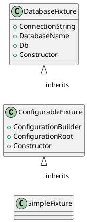

# ATAP.Utilities.Testing Fixtures

text

Diagram

```plantuml t
@startuml Testing Fixture Hierarchy
ConfigurableFixture <|--  SimpleFixture :" inherits"

DatabaseFixture <|-- ConfigurableFixture :" inherits"

Class DatabaseFixture {
  +ConnectionString
  +DatabaseName
  +Db
  +Constructor
  }

Class ConfigurableFixture {
  +ConfigurationBuilder
  +ConfigurationRoot
  +Constructor
  }
@enduml
```

ToDo: Investigate [Literate Code Map](https://github.com/abulka/lcodemaps)
csharp2plantuml.classDiagram
